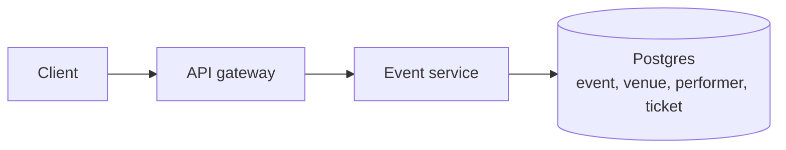
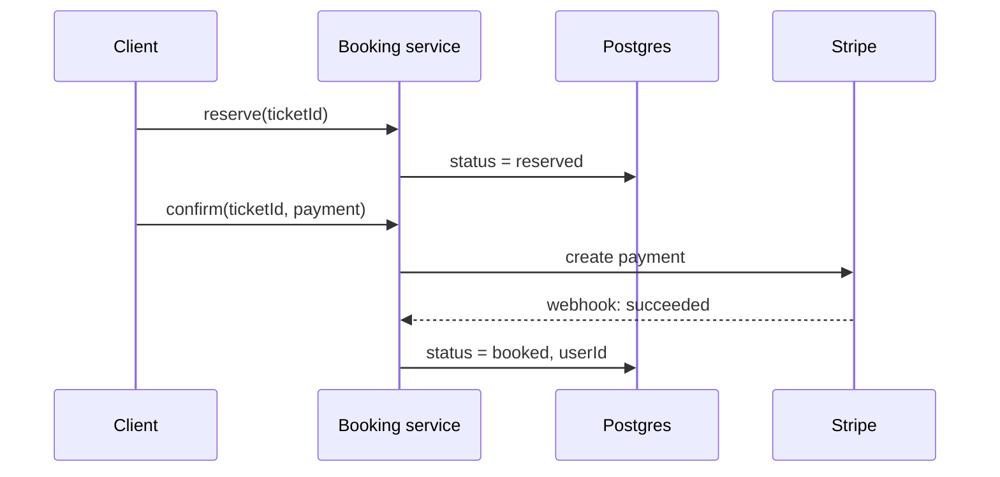
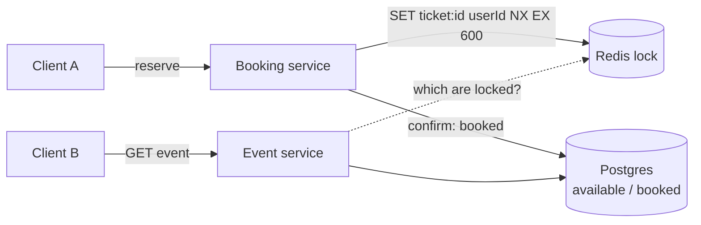
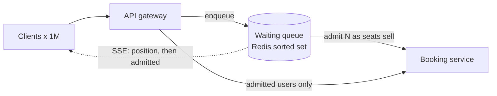
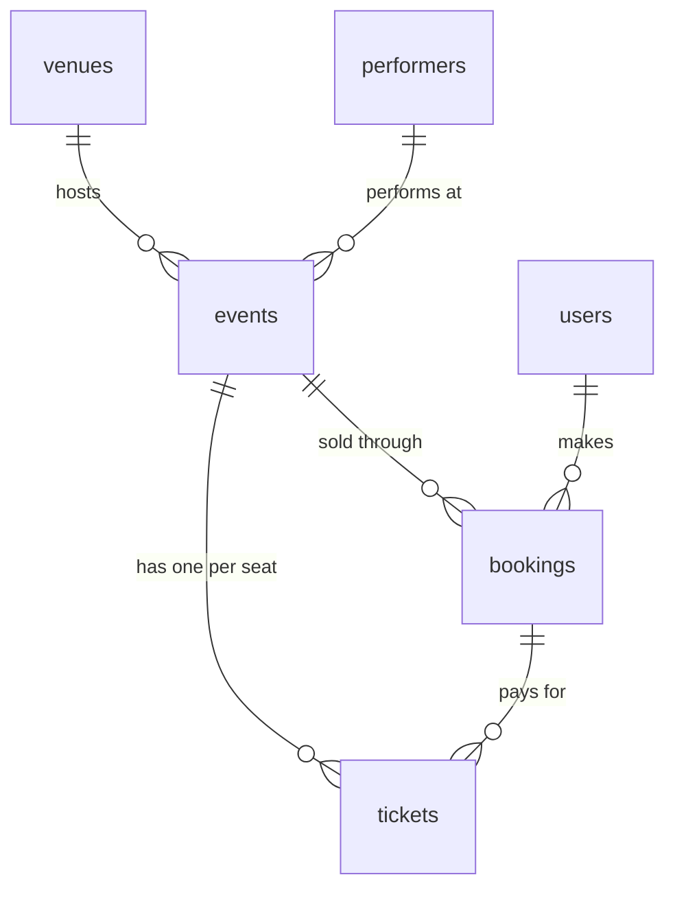

# Design Ticketmaster (event search and ticket booking)

Source: [Hello Interview, "System Design Interview: Design Ticketmaster w/ a Ex-Meta Staff Engineer"](https://www.youtube.com/watch?v=fhdPyoO6aXI) with Evan King, plus the [written breakdown](https://www.hellointerview.com/learn/system-design/problem-breakdowns/ticketmaster). High-level design starts at 17:30, deep dives at 35:00. Timestamps below point into the video.

Stack used in the video: API gateway, microservices, PostgreSQL, Redis (lock, cache, waiting queue), Elasticsearch with change data capture, Stripe, a CDN, server-sent events.

Sections marked **Beyond the video** add background the video skips or glosses over. Where the video and the write-up disagree, these notes follow the video and point out the difference.

Diagrams for each step live next to this file: `01 - View events` through `12 - Final architecture`.

## Understanding the problem

**What is this system?** A site where users search for concerts and games, open an event page with a seat map, and buy a specific seat. Most of the time traffic is calm. Then Taylor Swift tickets go on sale and 10 million people show up for 50,000 seats.

The property that drives the design: **one seat, one buyer, under extreme contention**. Everything else (search, event pages) can be eventually consistent and heavily cached. Booking cannot.

### Functional requirements (2:30)

Core requirements

1. Users should be able to book tickets.
2. Users should be able to view an event (details, performer, venue, seat map).
3. Users should be able to search for events.

Evan finds these by walking the user flow backwards: to book you need an event page, and to reach an event page you need search.

Below the line (out of scope)

1. Viewing your booked events.
2. Admins adding events.
3. Dynamic pricing for popular events.

### Non-functional requirements (4:00)

His main advice: don't list "scalable, available, fault tolerant" with no context. Every system wants those. Ask what makes *this* system hard.

1. **Consistency for booking, availability for everything else.** A mid-level answer says "prioritize consistency (CAP)". A senior answer splits it: strong consistency for booking tickets (no double booking), high availability for search and view. If a new event shows up in search two seconds late, nobody cares. If a user in Germany buys the seat I'm looking at in America, I must find out right away.
2. **Handle surges from popular events.** Traffic is steady until a huge on-sale, then tens of millions of users hit one event. The write-up puts a number on it: 10 million users, one event.
3. **Low latency search, under 500 ms.** He forgot this at first and added it back during the deep dives (36:30). Going back and editing requirements mid-interview is fine.
4. **Read heavy, about 100:1.** Roughly a 1% conversion rate from viewing to buying.

Below the line: GDPR, fault tolerance, secure payments, CI/CD, backups. List them, then check in with the interviewer: "Want me to move anything up?"

### Planning the approach

Build the simplest design that meets each functional requirement in order (view, search, book), then use the non-functional requirements to pick deep dives.

On back-of-envelope math (54:00): Evan skips it upfront on purpose. Candidates compute QPS and storage, say "wow, that's big", and change nothing. Do math only when the result changes a decision, for example whether Postgres needs sharding.

## Core entities (9:00)

- **Event**: the central record. Date, name, description, links to venue and performer.
- **Venue**: where it happens, including the **seat map** layout.
- **Performer**: artist or team.
- **Ticket**: one row per seat per event, with price and status. The key insight: tickets exist *before* anyone buys them. When an event is created, you generate one ticket per seat on the venue's map. Booking is then "claim an existing row", not "insert a new one", and that makes double booking a single-row problem.
- **User** and **Booking** appear in the write-up. A Booking groups several tickets under one order with one payment status. The video folds this into the ticket row (`status`, `userId`).

Evan doesn't list columns yet. They change during the design, so add them next to the database later.

## API or system interface (11:30)

REST, one or more endpoints per functional requirement.

```
GET  /events/:eventId                          -> Event & Venue & Performer & Ticket[]
GET  /search?term&location&type&date           -> Partial<Event>[]
POST /booking/reserve   { ticketId }           -> 200
PUT  /booking/confirm   { ticketId, paymentDetails } -> 200
```

- The event response includes tickets so the client can render the seat map.
- Search returns *partial* events: just enough for the results list.
- **Booking is two-phase (14:30).** You pick a seat, then get about 10 minutes on a payment page while the seat is held for you. That's the pattern on every airline and ticket site. If a candidate writes one `POST /book`, Evan points it out and expects them to split it.
- **No `userId` in the body (15:30).** Anyone could book on behalf of someone else by changing it. The user comes from the session token or JWT in the header.

The write-up starts with a single `POST /bookings/:eventId { ticketIds, paymentDetails }` and splits it later. Either way works if you say you'll revisit it.

## High-level design

Six steps. The first three satisfy the functional requirements. The next three fix one bug: abandoned reservations.

### 1) View events: API gateway, event service, Postgres (18:00)

**Decision:** client -> API gateway -> event service -> Postgres.

- **API gateway:** routes each request to the right microservice. Also handles authentication and rate limiting.
- **Event service:** reads the event, joins venue and performer, loads the tickets, returns everything.



```
event      id, venueId, performerId, name, description, date
venue      id, location, seatMap
performer  id, name, ...
ticket     id, eventId, seat, price
```

**Why Postgres? (21:00)** Tickets need ACID transactions, and events, venues and performers relate to each other. But Evan says the SQL vs NoSQL debate is stale: DynamoDB has transactions too. Mid-level candidates argue SQL vs NoSQL at length. Senior candidates name the properties they need ("transactions on the ticket row, some joins"), say both would work, and pick the one they know.

**Beyond the video: shared database across services.** The write-up points out that the event, search and booking services all share one database. "Database per service" is a guideline, not a law. Here the data is tightly coupled (bookings need tickets need events) and booking needs transactions across them, so splitting would add cost for no gain.

### 2) Search v1: a SQL LIKE query (23:30)

**Decision:** a search service that queries Postgres directly.

```sql
SELECT * FROM event
WHERE type IN (...) AND name LIKE '%swift%'
```

**What's suboptimal (and acknowledged):** the leading wildcard means no index helps, so every search is a full table scan. Evan says so out loud and moves on. Fixed in deep dive iteration 7.

**Beyond the video: why `%term%` can't use an index.** A B-tree index sorts values, like a phone book. `LIKE 'swift%'` can jump to the "swift" section. `LIKE '%swift%'` could match anywhere in the string, so the sort order is useless and the database reads every row.

### 3) Book tickets v1: status column and Stripe (25:00)

**Decision:** a booking service and a `status` column on ticket: `available | reserved | booked`.

1. **Reserve:** set the ticket to `reserved`. Return 200.
2. The client goes to a payment page.
3. **Confirm:** the booking service sends the payment to Stripe.
4. Stripe processes it asynchronously and calls back through a **webhook** your service exposes.
5. On success, set the ticket to `booked` and store `userId`.



**Why this prevents double booking:** Postgres writes to one row are serialized. Two users can't both flip the same ticket.

**What's broken (28:00):** the user reserves a seat and closes the laptop. The status stays `reserved` forever. The seat map hides reserved seats, so nobody else can buy it. This breaks the "10-minute hold" rule. Steps 4 to 6 fix it.

**Beyond the video: Stripe details.** The client tokenizes the card with Stripe.js, so raw card numbers never reach your servers (this keeps you out of most PCI scope). Stripe can deliver a webhook more than once, so the handler must be idempotent: store the booking or ticket ID in the payment metadata, and skip the update if it's already `booked`.

### 4) Expiry v1: reserved_at timestamp in the read query (29:00)

**Decision:** store `reserved_at`. When reading the seat map, count stale reservations as available.

```sql
SELECT * FROM ticket
WHERE event_id = ?
  AND (status = 'available'
       OR (status = 'reserved' AND reserved_at < now() - interval '10 minutes'))
```

**What it bought:** exact expiry, no background job.

**What's suboptimal:** the `status` column lies. A row says `reserved` when the seat is free, two columns must stay consistent, and every reader has to know the rule.

**Video vs write-up.** Evan calls this "okay" and moves on. The write-up ranks a close cousin as a *great* solution: on reserve, run a short transaction that checks "available, or reserved but expired" and then sets `reserved` with a new expiry. Correctness never depends on a background job, and a sweep job can tidy stale rows whenever it runs. Its costs are a slightly more complex read (fix with a compound index) and a less readable table.

### 5) Expiry v2: a cron job (29:30)

**Decision:** a cron job runs every 10 minutes, finds `reserved` tickets older than 10 minutes, and sets them back to `available`.

**What it bought:** the status column is honest again, except between runs. Evan says this is a **passing answer for mid-level** candidates.

**What's broken:** the lag. Call it *n*: the gap between when the hold should end and when the cron job runs. A seat reserved at 12:00 should free at 12:10. If the job runs at 12:19, n = 9 and the seat was held for 19 minutes. During a hot on-sale, that's inventory you can't sell. Also, if the cron job dies, seats pile up as reserved. Fixed in step 6.

### 6) Expiry v3 (great): a distributed lock in Redis with a TTL (31:00)

**Decision:** remove `reserved` and `reserved_at` from Postgres entirely. Ticket status is only `available | booked`. Reservations live in Redis:

```
key:   ticket:{ticketId}
value: userId          (the video says "true"; the write-up uses userId)
TTL:   10 minutes
```

- **Reserve:** write the key with a TTL. Nothing touches Postgres.
- **Abandon:** Redis deletes the key after 10 minutes. The seat frees itself at exactly 10:00.
- **Confirm:** after payment succeeds, set the Postgres row to `booked`, then delete the key.
- **Seat map:** the event service loads tickets with `status = available`, then checks each against Redis and marks locked ones as reserved.



**Why Redis and not a map in the booking service's memory? (33:00)** The booking service runs many instances. They all need the same view of who holds which seat.

**Why Redis at all, if Postgres is consistent?** Postgres has no row-level TTL. Redis has automatic key expiry built in, and it's fast under heavy concurrency.

**What if Redis goes down? (33:30)** A new one comes up, empty. For up to 10 minutes, several users may reach the payment page for the same seat. Postgres still accepts only one `booked` write, so the others get an error after typing their card details. Bad experience, but **no double booking**. Evan calls this a product decision and argues it's acceptable. The write-up adds that it's better than the cron failure mode, where every seat looks taken.

#### Beyond the video: making the lock correct

The video shows the idea. These details make it hold up:

- **Acquire atomically.** `SET ticket:{id} {userId} NX EX 600` sets the key only if it doesn't exist. Two users racing get exactly one success. A `GET` then `SET` would let both through.
- **Release only your own lock.** Delete with a small Lua script that checks the value is still your `userId`. Otherwise user A's late cleanup could delete user B's fresh reservation.
- **Make the Postgres write conditional.** The lock is an optimization. Postgres is the real guard:

  ```sql
  UPDATE ticket SET status = 'booked', user_id = $user
  WHERE id = $ticket AND status = 'available';
  ```

  Zero rows updated means someone else won. In Postgres this is safe even at the default READ COMMITTED isolation, because a concurrent `UPDATE` waits for the row lock and then re-checks the `WHERE` clause on the new version.
- **TTL expiring during payment.** User A's hold expires at minute 10, payment succeeds at minute 11, user B grabbed the seat at 10:30. The conditional update fails for one of them, and you refund that payment through Stripe. The write-up suggests extending the lock when payment starts.
- **Seat map reads.** Checking Redis once per ticket is 50,000 round trips for a stadium. Use `MGET`, or keep a per-event sorted set `event:{id}:reserved` scored by expiry time and read only scores in the future (the write-up's suggestion; a plain set would keep ghost entries after keys expire).
- **Redis failover loses locks.** Redis replicates asynchronously, so a promoted replica can miss recent keys. This is the same outcome as "Redis went down". Martin Kleppmann's critique of Redlock applies to locks used for *correctness*. Here the lock only improves the experience, so a single Redis primary is fine.

#### From the write-up: the bad option

**Long-running database locks.** `SELECT ... FOR UPDATE` inside a transaction held open for the whole 10-minute checkout. Database locks are meant to last milliseconds. Holding thousands of transactions open for minutes ties up connections, invites deadlocks, and releasing on abandonment depends on session timeouts. The video doesn't cover this option, but candidates propose it often.

### Where the high-level design stands (35:00)

| Requirement | Status | Why |
| --- | --- | --- |
| No double booking | Met | Conditional write on the Postgres row, Redis lock for holds |
| Availability for search and view | Partly | Works, but every read hits Postgres |
| Search under 500 ms | **Broken** | `LIKE '%term%'` is a table scan |
| Surges from popular events | **Broken** | Nothing protects the backend or the seat map from 10M users |
| 100:1 read heavy | Not addressed | No caching |

Evan's note for mid-level: getting to the Redis lock already puts you in good shape. Most mid-level candidates stop at the cron job.

### The evolution at a glance

| Step | Decision | What it bought | What it broke or left open |
| --- | --- | --- | --- |
| 1 | Gateway, event service, Postgres | View works, ACID on tickets | Every read hits the DB |
| 2 | Search with `LIKE` | Search works | Full table scan |
| 3 | `status` column, Stripe webhook | Two-phase booking, no double booking | Abandoned holds last forever |
| 4 | `reserved_at` in the read query | Exact expiry | Status column lies |
| 5 | Cron job resets holds | Honest status | Up to one cron period of lag |
| 6 | Redis lock with TTL | Instant expiry, clean table | Lock loss hurts UX (not correctness) |

## Potential deep dives

Evan's process (36:00): look at your non-functional requirements, find what's missing, and go deep on one to three of them. Senior and staff candidates should lead this part.

### 1) Low latency search (36:30)

#### Bad solution: B-tree indexes and query tuning (from the write-up)

Index `name`, `date`, `venue location`. Use `EXPLAIN`, avoid `SELECT *`, add `LIMIT`.

**Challenges.** Indexes help equality and prefix matches but not `%swift%`. They also slow every write and take storage.

#### Good solution: Postgres full-text search (from the write-up)

Postgres has `tsvector` columns with GIN indexes; MySQL has FULLTEXT indexes. Queries for words like "Taylor" become index lookups.

**Challenges.** Weaker relevance ranking, fuzzy matching and geo search than a search engine. And the search load lands on the same database that handles bookings.

#### Great solution: Elasticsearch fed by change data capture (37:00)

**How an inverted index works.** Take each event's text, split it into terms, and build a map from term to the events containing it:

```
"playoff" -> [event1, event2, event3]
"swift"   -> [event5, event6, event9]
```

A search for "playoff" is a map lookup, not a scan. Elasticsearch combines this with geo indexes and date filters in one query, and supports fuzzy matching ("Tayler Swift").

**Keep Postgres as the source of truth (39:30).** Elasticsearch is a poor primary store: weaker durability guarantees and no multi-document transactions. Evan's first startup used it as the primary store and regretted it.

**Syncing the two:**

1. **Dual writes in application code.** Write to Postgres and Elasticsearch in the same request. You must handle one write failing: retry, or undo the other.
2. **Change data capture (40:30).** Stream every Postgres change to a consumer that updates Elasticsearch. In an interview, drawing an arrow labeled "CDC" is usually enough, but say it hides a stream and a worker.

**Does it need a queue in front?** Evan notes Elasticsearch struggles with very high write rates. Here events change rarely (tens to thousands per day), so no.

**Challenges.** Another cluster to run and pay for. The index lags Postgres by a little, which is fine given availability-over-consistency for search.

**Beyond the video: two corrections.**

- *Geo search.* Evan guesses Elasticsearch uses "quad trees and geohashing". Since version 5 Lucene stores geo points in **BKD trees** (a kind of k-d tree). Geohash grids show up in aggregations, not the core index.
- *Write limits.* Elasticsearch can index thousands of documents per second per node. The real cost is that each refresh (default every 1 s) creates a new segment, and each single-document update is expensive compared to the `_bulk` API. For write-heavy feeds, batch through a queue. Near-real-time search also means a new document is invisible for about a second.

#### Making popular queries faster: caching (42:30)

Search results aren't personalized here, so two users typing the same query get the same answer. That makes caching work.

1. **Elasticsearch / OpenSearch built-in caches.** Evan describes a node query cache holding the top 10K queries per shard, LRU. **Beyond the video:** the *node query cache* stores results of **filter clauses** (which documents match `type = concert`), LRU, up to 10,000 entries by default. Whole responses go in the separate *shard request cache*, which by default only caches `size=0` requests like aggregations and counts. Useful, but not "cache the full results of popular searches".
2. **Redis or Memcached.** Key on a normalized form of every search parameter, value is the results, add a TTL. Invalidate when events change.
3. **CDN (44:00), Evan's pick.** The system already has a CDN for images. Cache `GET /search?...` responses at the edge for 30 to 60 seconds. Popular queries return from a server near the user.

**Challenges for the CDN.** Hit rates collapse as query permutations grow. With raw lat/long in the query, no two users share a key. With a city name, they might. And the moment results become personalized, shared caching is wrong.

**The key insight:** search tolerates staleness, so the design can push it far from the database: an index built from CDC, then caches in front of that. The booking path gets none of that freedom.

### 2) Surges from popular events (46:30)

#### Problem 1: the seat map goes stale

The event page loads, then other users keep buying. After a few seconds the map shows seats that are gone, and users click them and get errors.

**Option A, long polling (48:00).** The client sends a request and the server holds it open for 30 to 60 seconds, replying when a seat changes. The client loops. Cheap, no new infrastructure, fine if users stay on the page for a few minutes.

**Option B, server-sent events (49:00).** A persistent connection the server pushes over. SSE is one-way, server to client, which is all a seat map needs. WebSockets would also work but are two-way, more than required. Evan's design pushes a change to every open map whenever a lock is set, expires, or a ticket is booked.

**Beyond the video: what the push needs behind it.** The event service instances each hold some SSE connections, but a lock can be set by any booking instance. Something has to fan changes out, for example Redis Pub/Sub on `event:{id}:seats`, or Redis keyspace notifications on lock expiry. Evan calls this implementation out of scope. Also: over HTTP/1.1 browsers allow about six connections per domain, so use HTTP/2 for SSE. SSE reconnects on its own and can resume with `Last-Event-ID`.

**Challenges (50:30).** For Taylor Swift, the map turns black within milliseconds. A million users fight over 50,000 seats. A fresher map doesn't create seats.

#### Problem 2: too many people for too few seats. A virtual waiting queue (51:00)

**Decision:** for events an admin flags as hot, users don't see the seat map at first. They join a queue and get "You're in line."

1. The queue is a Redis sorted set, scored by arrival time. Some implementations randomize the score for fairness, so users close to the servers don't always win.
2. As seats sell, let the next batch in: 100 bookings done, admit the next 100 (or 1,000).
3. Notify admitted users over the SSE connection. The write-up adds an `admitted:{eventId}` set with a TTL, and the booking service rejects reservations from anyone not in it. Without that check, users could skip the queue by calling the API directly.



**Challenges.** Long waits frustrate people, so push position and an estimated wait. The queue must survive the spike itself.

**The key insight (53:00):** Evan's point is that the best answer here is simple, not technically complex. The problem is scarcity, and no amount of backend scaling fixes it. Controlling admission fixes both the user experience and the load.

**Beyond the video: real numbers.** When Taylor Swift's Eras Tour presale opened in November 2022, Ticketmaster said it saw 3.5 billion system requests, four times its previous peak, largely from bots and fans without presale codes. Real deployments pair the queue with bot defenses (Ticketmaster's "Verified Fan" pre-registration, CAPTCHAs, per-account rate limits at the gateway). An interviewer may ask about bots.

### 3) Scaling reads (53:30)

Evan finds this the least interesting deep dive because the answer is standard:

- **Horizontal scaling.** Services are stateless. A managed API gateway (AWS) load balances, and each service autoscales on CPU or memory.
- **Sharding, if the math says so (55:00).** Shard by `eventId`, since most queries are per event. Or by venue, if you distribute shards geographically and users mostly search nearby.
- **Cache static data (56:00).** Events, venues and performers almost never change. Put them in Redis keyed by `eventId`. Invalidate or update on write. They're small enough that you may not need an eviction policy, or bound it to upcoming events. Only ticket status still hits Postgres.

The write-up adds: read-through caching, database triggers to invalidate, long TTLs for venue data and short ones for availability, and round-robin or least-connections load balancing.

**Beyond the video: the math that decides sharding.** My rough estimate, not from either source:

- Ticketmaster sells on the order of 500 million tickets a year. Include unsold seats and say 1 billion ticket rows a year at ~200 bytes each: **~200 GB a year**. That fits on one Postgres primary for years. Storage alone doesn't force sharding.
- Reads are the load. 10 million users on one event page refreshing every 5 seconds is **~2 million reads a second**, on one event. Sharding by `eventId` sends all of that to one shard, so sharding doesn't help a hot event. The cache (static data) and read replicas (ticket status) carry it, and the waiting queue caps how many users reach the page.
- Writes are small. Even with the queue admitting 5,000 users a second, that's a few thousand single-row updates a second, spread across 50,000 different rows. Contention is per seat, not per table.

## Final data model (multi-seat bookings)

The notes use several words for overlapping things: seat, ticket, reservation, hold, booking, order. They are not all tables. A **ticket** is one seat at one event, created when the event is created. A **seat** is not its own table; it's the `seatLabel` column on a ticket, and the venue's layout lives in `venues.seatMap`. A **reservation** or **hold** is a Redis lock with a 10-minute TTL, never a database row. A **booking** (the write-up's order) groups the tickets one user buys in one payment. This model follows the write-up and adds `bookings`, because the video's `userId` column on `ticket` can't represent one payment for several seats.

The same tables, without the mapping, are drawn in the "Data model" area of `12 - Final architecture`.

### Terms mapped to entities

| Term used in the notes | What it is | Stored as |
| --- | --- | --- |
| Event | A concert or game on a date at a venue | `events` row |
| Venue | The place, with its seat layout | `venues` row |
| Seat map | The venue's layout of sections, rows and seats | `venues.seatMap` column |
| Performer | Artist or team | `performers` row |
| Ticket | One seat at one event, sold or not | `tickets` row, created with the event |
| Seat | A position in the layout | `tickets.seatLabel` column, no table |
| Reservation / hold | A user's 10-minute claim on a seat during checkout | Redis key `ticket:{ticketId}` with TTL, not a table |
| Booking / order | One purchase of one or more tickets with one payment | `bookings` row |
| User / buyer | A person with an account | `users` row |
| Queue position, admitted user | A user's place in a hot event's waiting line | Redis sorted set and set, not tables |
| Search result | An event as Elasticsearch indexes it | Elasticsearch document, derived from Postgres by CDC |

### Tables

Postgres. PK is the primary key, FK a foreign key.

**`users`**

| Column | Notes |
| --- | --- |
| `id` (PK) | |
| `email` | unique, used to log in |
| `name` | |
| `createdAt` | |

**`performers`**

| Column | Notes |
| --- | --- |
| `id` (PK) | |
| `name` | |
| `type` | `ARTIST` or `TEAM` |
| `description` | |

**`venues`**

| Column | Notes |
| --- | --- |
| `id` (PK) | |
| `name` | |
| `location` | geo point, used by search filters |
| `seatMap` | JSONB layout of sections, rows and seats. Static, so cache it and send it once |

**`events`**

| Column | Notes |
| --- | --- |
| `id` (PK) | |
| `venueId` (FK) | |
| `performerId` (FK) | |
| `name`, `description` | |
| `type` | `CONCERT`, `SPORTS`, ... for search filters |
| `startsAt` | event date and time |
| `queueEnabled` | admin flag for hot events. When true, users go through the virtual waiting queue first |
| `createdAt`, `updatedAt` | `updatedAt` feeds CDC into Elasticsearch |

**`tickets`**

| Column | Notes |
| --- | --- |
| `id` (PK) | |
| `eventId` (FK) | index on `(eventId, status)` for "available seats for this event" |
| `seatLabel` | e.g. `SEC 112 / ROW F / 14`. Unique per event: `UNIQUE (eventId, seatLabel)` |
| `price` | in cents |
| `status` | `AVAILABLE` or `BOOKED`. No `RESERVED`: holds live in Redis |
| `bookingId` (FK) | null until booked |
| `updatedAt` | |

Created in a batch job when the event is created: one row per seat, around 70,000 for a stadium. The video put `userId` here; with bookings, the buyer is `bookings.userId`.

**`bookings`**

| Column | Notes |
| --- | --- |
| `id` (PK) | |
| `userId` (FK) | taken from the JWT, never the request body |
| `eventId` (FK) | |
| `status` | `PENDING`, `CONFIRMED`, `FAILED` or `REFUNDED` |
| `totalAmount` | in cents, computed on the server from ticket prices |
| `stripePaymentIntentId` | links the Stripe webhook back to this booking |
| `idempotencyKey` | unique. The client sends it on confirm, and it's also passed to Stripe, so a retried confirm never charges twice |
| `createdAt`, `updatedAt` | |

### Relations



- A venue hosts many events. An event has one venue and one performer.
- An event has one ticket per seat, all created up front.
- A user makes many bookings. A booking belongs to one user and one event and pays for one or more tickets.
- A ticket belongs to at most one booking, and only once it's `BOOKED`.

### How the tables work together on booking

Alice buys seats 14 and 15 in row F for event 42, which is flagged `queueEnabled`.

1. Alice joins the waiting queue (Redis sorted set). When she's admitted, her ID goes into `admitted:42`.
2. She opens the event page: `events` and `venues` (cached) plus `tickets WHERE eventId = 42 AND status = 'AVAILABLE'`, minus any seats locked in Redis.
3. She picks two seats. The booking service checks `admitted:42`, then locks both tickets in Redis with `SET ticket:{id} alice NX EX 600`. If either lock fails, it releases the other.
4. It inserts a `bookings` row with status `PENDING`, the total from the ticket prices, and Alice's `idempotencyKey`.
5. It creates a Stripe payment with the same idempotency key and stores `stripePaymentIntentId`.
6. Stripe's webhook arrives. In one transaction: `UPDATE tickets SET status = 'BOOKED', bookingId = :b WHERE id IN (:t14, :t15) AND status = 'AVAILABLE'` must update exactly 2 rows, and the booking becomes `CONFIRMED`. If fewer rows update, roll back, mark the booking `FAILED` and refund.
7. It deletes the Redis locks and pushes the seat change to open seat maps over SSE.

### What is not a table

- **Seat holds**: Redis `ticket:{ticketId}` -> userId, 10-minute TTL. Expiry is the whole point, and Postgres has no row TTL.
- **Reserved-seat index**: optional Redis sorted set `event:{id}:reserved` scored by expiry, so the seat map reads one key instead of 50,000.
- **Waiting queue and admitted set**: Redis `queue:{eventId}` (sorted set) and `admitted:{eventId}` (set with TTL).
- **Search index**: Elasticsearch documents built from `events`, `venues` and `performers` by CDC. Rebuildable, never the source of truth.
- **Caches**: event, venue and performer data in Redis, search responses at the CDN.

### The limit this model creates

Every ticket for one event lives under one `eventId`, so a hot event is a hot key range. Sharding by `eventId` puts all of Taylor Swift's writes and ticket reads on one shard, and no amount of sharding spreads a single event. The model survives because the design keeps traffic off those rows: static data comes from cache, availability reads from replicas plus Redis, and the waiting queue admits users no faster than that one shard can book. Multi-seat locks add a second constraint: locking all seats atomically with one Lua script needs the keys on one Redis node, so use a `{eventId}` hash tag.

## Beyond the video: gaps worth knowing

- **Multi-seat bookings.** Users usually buy 2 to 4 seats together. Acquire locks one by one and release all if any fails, or use a Lua script to lock all seats atomically (needs the keys on one Redis node, for example with a `{eventId}` hash tag). The Booking entity groups them under one payment.
- **Idempotent reserve and confirm.** Mobile clients retry. A retried confirm must not charge twice. Use an idempotency key per booking attempt, and pass it to Stripe too (Stripe supports `Idempotency-Key` headers).
- **Ticket generation.** Creating an event means inserting one ticket per seat: 70,000 rows for a stadium. Do it in a batch job when the event is created, not on first view.
- **Seat map payload.** 50,000 seats is a big response. Send the static layout once (cacheable, from Venue) and only a compact availability bitmap or diff for status.
- **Stale-read guard.** Reads are eventually consistent (cache, replicas, stale maps). That's fine because the conditional write on booking is the only place correctness is decided.

## What is expected at each level? (57:00)

### Mid-level

About 80% breadth, 20% depth. Clear API and data model, a working design for viewing and booking. Must prevent double booking with at least the status field plus cron job. Evan says the design in this video is overkill for mid-level.

### Senior

About 60% breadth, 40% depth. Move through the high-level design quickly. Expected to reach Elasticsearch for search, a distributed lock for reservations, and to discuss popular events, sharding and replication (hints are OK).

### Staff+

About 40% breadth, 60% depth, two or three areas in real depth, drawn from experience. The interviewer should only step in to focus the conversation, not steer it. A good sign: the interviewer learns something from you.

## Check yourself

1. Why does "strong consistency for booking, high availability for search and view" beat "prioritize consistency"?
2. Why are ticket rows created when the event is created, not when a seat is bought?
3. Why shouldn't `userId` go in the reserve request body?
4. Why can't a B-tree index speed up `LIKE '%swift%'`?
5. What goes wrong with a single `status` column and no expiry?
6. With a 10-minute hold and a cron job every 10 minutes, what's the worst-case time a seat stays held?
7. Why is the Redis lock stored outside the booking service's memory?
8. Redis loses all locks. Can two users end up booked into the same seat? Why or why not?
9. Which SQL statement actually guarantees no double booking, and why is it safe under READ COMMITTED in Postgres?
10. Why shouldn't Elasticsearch be the primary store, and what keeps it in sync?
11. When does caching search results in a CDN stop working?
12. SSE makes the seat map live. Why doesn't that fix the Taylor Swift on-sale, and what does?
13. Which of seat, ticket, reservation and booking are tables in the final model, and where does each of the others live?
14. Why does the final model add a `bookings` table instead of keeping `userId` on `tickets`?

<details>
<summary>Answers</summary>

1. Different parts of the system need different guarantees. Search and view can be stale for seconds and must stay up, so you can cache them and serve them eventually consistent. Only booking needs strong consistency.
2. Booking becomes "claim an existing row". Double booking reduces to two writers racing on one row, which the database already serializes.
3. The client controls the body, so anyone could book as someone else. Take the user from the verified JWT or session in the header.
4. The index is sorted by the start of the value. A leading wildcard can match anywhere in the string, so the sort order doesn't help and every row is read.
5. Abandoned checkouts leave seats `reserved` forever and nobody else can buy them.
6. Almost 20 minutes: 10 minutes of hold plus up to 10 more until the next run.
7. The booking service runs many instances. They all need one shared view of who holds which seat.
8. No. Several users may reach payment for the same seat, but Postgres accepts only one `booked` write. The rest get an error (and a refund if already charged).
9. `UPDATE ticket SET status='booked', user_id=? WHERE id=? AND status='available'`. A concurrent update waits for the row lock, then re-checks the `WHERE` on the committed version, so the second writer updates zero rows.
10. Weaker durability and no multi-document transactions. Change data capture (or careful dual writes) streams Postgres changes into it.
11. When queries have too many permutations (raw lat/long, many filters), so keys rarely repeat, or when results become personalized.
12. The problem is too many users for too few seats, and a fresher map just shows them vanish faster. A virtual waiting queue limits who reaches the seat map and admits batches as seats sell.
13. Tickets and bookings are tables. A seat is the `seatLabel` column on a ticket, with the layout in `venues.seatMap`. A reservation is a Redis key with a 10-minute TTL.
14. One purchase often covers several seats with one payment. A booking row holds the buyer, the payment status, the Stripe payment ID and the idempotency key once, and each ticket points to it.

</details>
