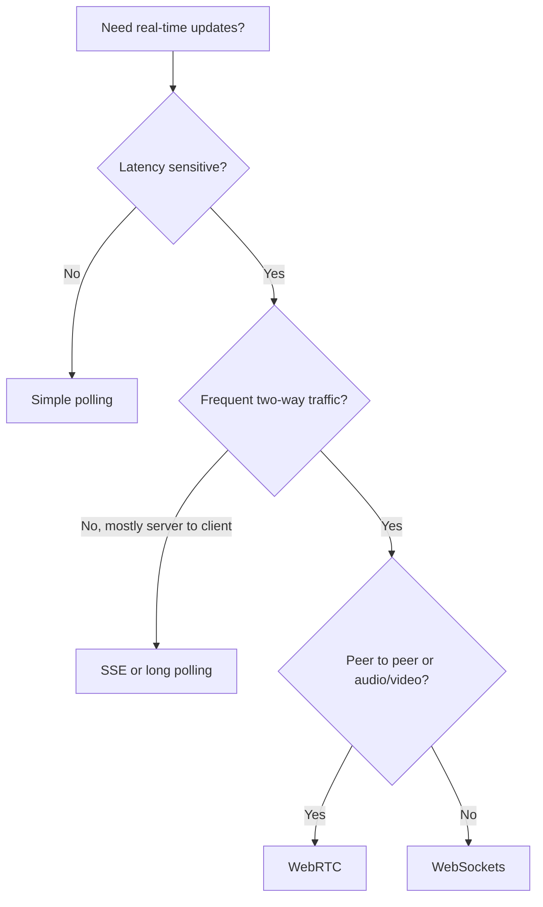
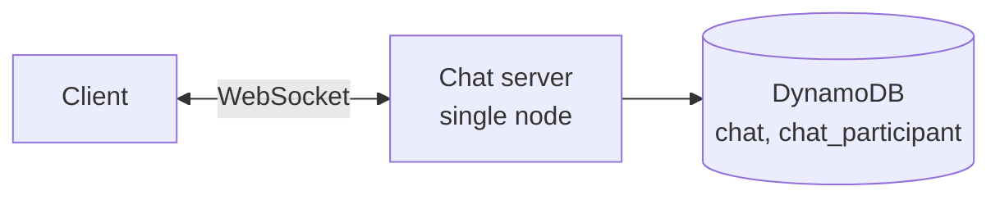
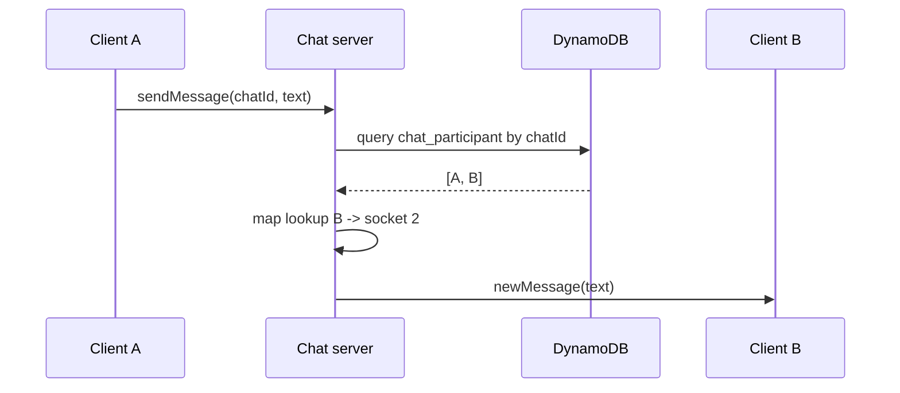
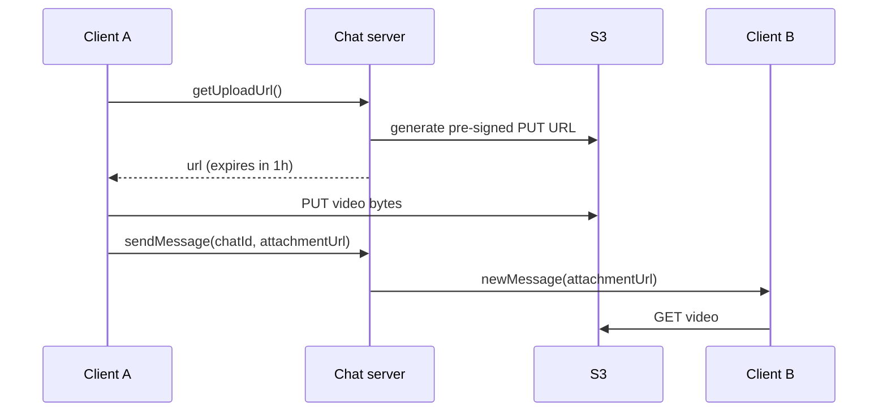
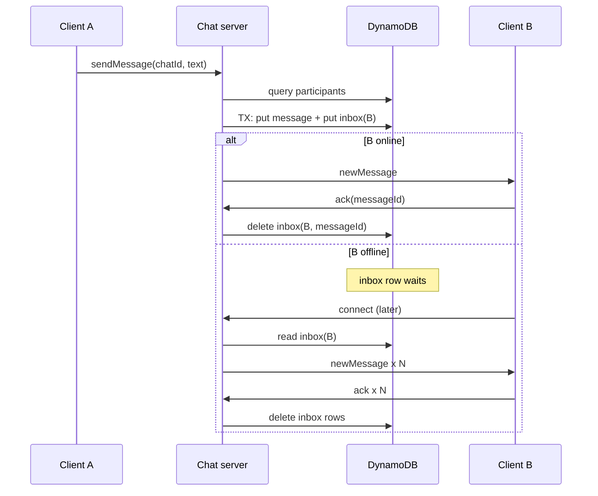
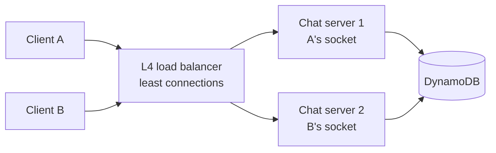
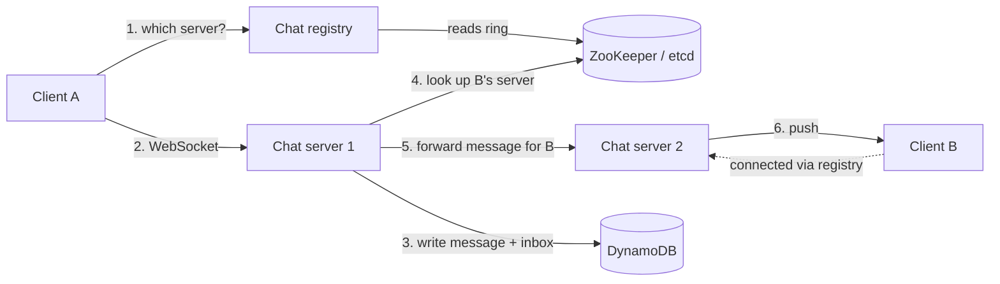
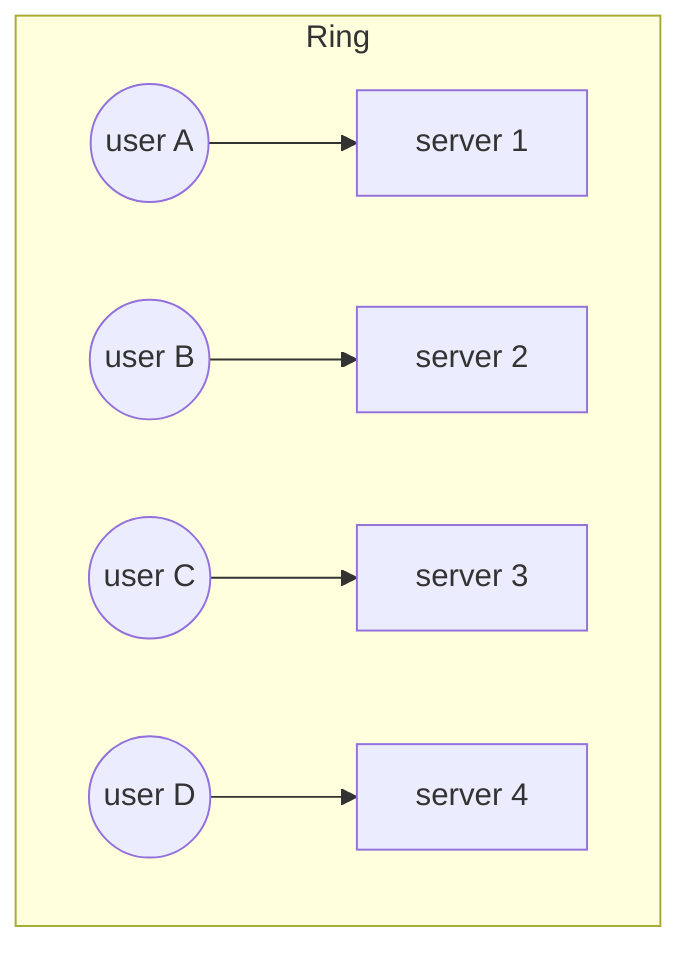
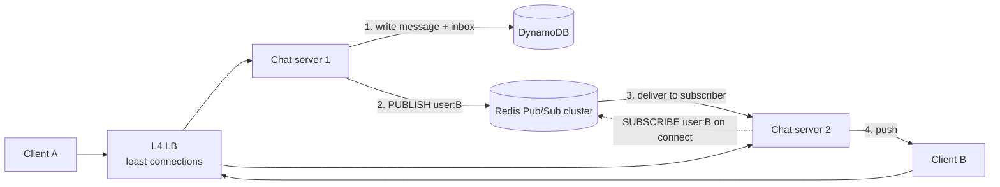
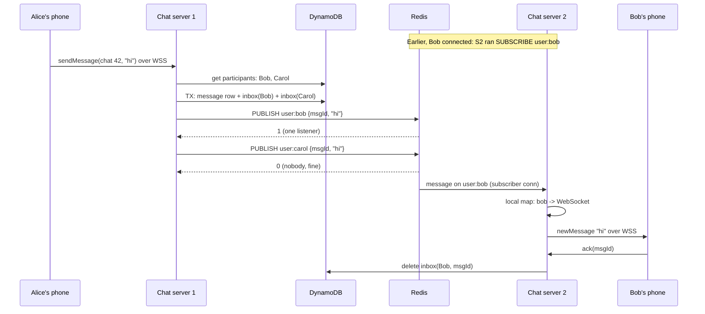

# Design WhatsApp (chat and messaging)

Source: [Hello Interview, "Design WhatsApp" with Stefan (ex-Meta senior manager)](https://www.youtube.com/watch?v=cr6p0n0N-VA). High-level design starts at 17:30, deep dives at 32:00. Timestamps below point into the video.

Stack used in the video: WebSockets, a layer 4 load balancer, DynamoDB, S3, ZooKeeper or etcd, Redis Pub/Sub.

Sections marked **Beyond the video** add background the video skips or glosses over. Everything else follows the video.

## Understanding the problem

**What is this system?** A chat app where users create 1:1 or group chats, send text and media, and get messages they missed while their phone was off. Billions of users, and messages should arrive in well under a second.

The interesting part is not storage. Chat servers are *stateful*: each one holds live connections to specific users. Most of the design follows from that.

### Functional requirements

Core requirements

1. Users should be able to start group chats. A 1:1 chat is a group of two.
2. Users should be able to send and receive messages in a chat.
3. Users should be able to send and receive media attachments (images, video, audio).
4. Users should be able to access messages they received while offline.

Below the line (out of scope)

1. Audio and video calling.
2. Online/offline presence (comes back as an extension at the end).
3. Spam, abuse, scraping of contact info.

Stefan spent about 2 minutes on these. His advice: keep the list short, and don't pad "below the line" with things you'll never touch.

### Non-functional requirements

1. **Low latency, quantified.** Messages delivered in under 500 ms. Nobody holds two phones side by side, and the gap between 100 ms and 500 ms is hard to notice. Picking 500 ms instead of "as fast as possible" gives the design a budget to spend later (for example, an extra network hop through Redis).
2. **Guaranteed delivery.** A sent message must eventually reach every recipient.
3. **Scale.** Billions of users, high throughput. He deliberately skips message math here and does it later when he knows the data model.
4. **Don't store messages longer than needed.** WhatsApp is a privacy product. User data you don't need is "toxic sludge", a liability you want to delete or encrypt.
5. **Fault tolerance.** At this size something is always broken. One failing component must not take down the app.

### Planning the approach

Build the simplest design that meets every functional requirement, even if it runs on one server. Then use the deep dives to fix the non-functional requirements it breaks. Stefan's reasons:

1. Real systems evolve this way. Nobody ships the optimal version on day one.
2. Candidates who jump straight to "scalable" often never finish the functional requirements, and then the interviewer can't give credit for a working system.

While doing this, say out loud that you know the single-server version doesn't scale. Otherwise the interviewer may assume you don't know.

## Core entities

- **User**: all users are peers. No special roles, unlike Uber (rider, driver) or YouTube (creator, viewer).
- **Chat**: a conversation with metadata (name, id).
- **Chat participant**: membership of a user in a chat.
- **Message**: content, sender, timestamp.
- **Client (device)**: the key insight. A *device* goes offline, not a person. My phone can be off while my laptop is online, so delivery must be tracked per device.

## API or system interface

### First, pick the connection type

The API depends on how the client and server talk. The video walks through a decision tree (Hello Interview's "real-time updates" pattern):



For WhatsApp: 500 ms latency rules out plain polling. Users send as often as they receive, so one-way SSE doesn't fit. No audio or video in scope, so no WebRTC. That leaves **WebSockets**. Stefan notes the real WhatsApp uses a plain persistent TLS connection with its own protocol, but the idea is the same: one long-lived, two-way connection per device.

A REST API alone doesn't work, because the server has no way to push a new message to the client.

#### Beyond the video: the connection options

| Option | How it works | Good for | Why not here |
| --- | --- | --- | --- |
| Polling | Client asks "anything new?" every N seconds | Dashboards, low urgency | Either slow (big N) or wasteful (small N) |
| Long polling | Server holds the request open until there's data, client re-requests | Occasional pushes | A new HTTP request per message, awkward for chat-rate traffic |
| SSE | One HTTP response that streams server-to-client events | Live feeds, notifications | One direction only. Sending still needs separate HTTP calls |
| WebSocket | HTTP request "upgraded" into a full-duplex TCP connection | Chat, games, collaborative editing | Chosen |
| WebRTC | Peer-to-peer media and data channels | Calls, video | Out of scope, heavy setup (STUN/TURN) |

The cost of WebSockets: the server now holds *state* (open connections). You can't send a user's message to any random server, it has to reach the server holding that user's socket. That fact drives every scaling decision later.

### Commands

WebSocket APIs have no standard like REST, so describe them as commands in each direction.

Client to server:

```
createChat        { participants: [userId], name }            -> { chatId }
sendMessage       { chatId, message, attachments: [url] }     -> "SUCCESS" | "FAILURE"
createAttachment  { body / metadata }                         -> { attachmentUrl }   // refined to pre-signed URL later
modifyChatParticipants { chatId, userId, op: ADD | REMOVE }
```

Server to client:

```
newMessage   { chatId, userId, message, attachments }  -> client replies with ack { messageId }
chatUpdate   { chatId, participants }                   -> ack
```

Tell the interviewer this is a first sketch you'll refine. That's normal. The thing to avoid is leaving a visible mistake without flagging it.

## High-level design

This is where the design evolves. Each step is a deliberate simplification, and the next step exists because the previous one broke something.

### 1) Start group chats: one chat server, one database (19:00)

**Decision:** a single chat server. The client opens a WebSocket to it, and the server talks to DynamoDB.

**Why a single server?** It removes the hardest problem (routing between servers) so you can get every functional requirement working first. Stefan says outright that this "creates problems I'll solve later."

**Why DynamoDB?** Any key-value store works, and so would a relational DB. He pushes back on "relational doesn't scale", citing Shopify's MySQL numbers on Black Friday. Pick what you can defend.



Tables:

```
chat              PK: chatId            | name, metadata
chat_participant  PK: chatId, SK: participantId
                  GSI: PK participantId, SK chatId
```

Two queries matter, and the keys are chosen for them:

- "Who is in chat X?" (needed to send a message) uses the primary key: partition `chatId`, sort by `participantId`.
- "Which chats am I in?" (needed to render the chat list) uses a **global secondary index** keyed by `participantId`.

#### Beyond the video: DynamoDB keys in two minutes

- **Partition key** decides which physical partition stores the item (DynamoDB hashes it). All items with the same partition key live together.
- **Sort key** orders items inside a partition, so "all participants of chat X" is one cheap range read.
- **GSI** is a second copy of the table, re-keyed by other attributes, kept up to date asynchronously by DynamoDB. It lets you query by `participantId` without scanning. It is eventually consistent, so a freshly joined chat may take a moment to appear in the list.

### 2) Send and receive messages: an in-memory map of sockets (22:00)

**Decision:** the chat server keeps a hash map `userId -> WebSocket`.

Flow:

1. Client A sends `sendMessage { chatId, text }`.
2. Server queries `chat_participant` for all participants of `chatId`.
3. For each participant, look up their socket in the map and push `newMessage`.



**Why this works now:** one server holds *every* socket, so every recipient is in the local map.

**What's suboptimal (and acknowledged):** messages aren't stored anywhere. If B is offline, the message is gone. It's a live chat room, not a messenger. Step 4 fixes this.

### 3) Media attachments: three versions (24:00)

This is the clearest mini-evolution in the video.

#### Version 1 (bad): store the bytes in DynamoDB, send them over the WebSocket

Client uploads the video through the chat server into an `attachments` table.

Two problems:

1. **Wrong storage.** DynamoDB isn't built for blobs. Videos can be hundreds of MB. (Beyond the video: a DynamoDB item maxes out at 400 KB, so this physically can't hold a video without chunking.)
2. **Wrong server.** Chat servers are tuned for many tiny messages ("omw"). Pushing gigabyte uploads through them steals bandwidth and memory from millions of connections. Stefan's rule of thumb: a huge size disparity between payloads on the same path is a sign something's wrong.

#### Version 2 (better): chat server writes to S3

S3 fixes storage: built for large objects, durable, cheap.

Still broken: every byte still flows *through* the chat server. Problem 2 remains.

#### Version 3 (good): pre-signed URLs

1. Client asks the chat server for an upload target.
2. Chat server uses its own AWS credentials to ask S3 for a **pre-signed URL**: a URL with a signature and expiry baked in ("you may PUT to this key for the next hour").
3. Client uploads directly to S3.
4. Client sends a normal `sendMessage` whose body contains the S3 URL, not the bytes.
5. Recipients get the URL and download straight from S3 (or a CDN in front of it).



Now the chat server only handles small messages, and it reuses the messaging path from step 2 unchanged.

Loose ends he mentions: expire media after it's delivered (say 30 days, via S3 lifecycle rules), and cap upload sizes so people don't use you as Google Drive.

### 4) Offline delivery: messages table plus inbox (28:00)

Your timestamp (28:39) lands here. This is where the design stops being a live chat room.

**The problem:** so far delivery depends on the recipient holding an open socket at the moment the message arrives. Offline users get nothing.

**Decision:** persist every message, and keep a per-recipient list of what they haven't received yet.

```
message   PK: messageId        | chatId, senderId, content, timestamp (set by the server)
inbox     PK: recipientId, SK: messageId
```

The chat server sets the timestamp, not the client, so ordering doesn't depend on phone clocks.

Send flow:

1. Client A sends `sendMessage`.
2. Server looks up participants (primary key on `chat_participant`).
3. **One DynamoDB transaction** writes one `message` row and one `inbox` row per recipient.
4. For every recipient with a live socket, push the message.
5. Recipient client replies with an **ack** for `messageId`.
6. On ack, server deletes that `inbox` row.

Reconnect flow:

1. Client connects.
2. Server reads all `inbox` rows for that recipient, loads the message bodies, and pushes them.
3. Client acks each one, and the server deletes the inbox rows.



**Why a transaction?** If the message row were written but some inbox rows failed, those recipients would never know the message exists. The transaction makes it all-or-nothing.

**The catch Stefan calls out:** DynamoDB transactions cap at 100 items. One message row plus one inbox row per recipient means group chats max out around 99 recipients. That's a product constraint you have to state.

**What this guarantees:** eventual delivery. Online recipients get it now. Offline recipients get it the next time they connect.

#### Beyond the video: the delivery guarantee vocabulary

- **At-most-once:** send and forget. Might be lost, never duplicated.
- **At-least-once:** retry until acked. Never lost, might be duplicated.
- **Exactly-once:** usually "at-least-once plus dedupe on the receiver".

The inbox plus ack gives **at-least-once**. If the ack is lost (phone drops signal right after receiving), the inbox row stays and the message gets sent again on reconnect. So the client must dedupe by `messageId`. The video doesn't say this, but any real implementation needs it.

### Where the high-level design stands (32:00)

Checking each non-functional requirement against the single-server design:

| Requirement | Status | Why |
| --- | --- | --- |
| Under 500 ms | Met | Server holds every socket and pushes immediately |
| Guaranteed delivery | Met | Message and inbox rows are durable, acks clear them |
| Billions of users | **Broken** | One server can't hold billions of connections, and it's a single point of failure |
| Don't store unnecessarily | Not addressed | Nothing deletes old messages |
| Fault tolerance | **Broken** | One server |

So the deep dives exist to fix scale and retention.

### The evolution at a glance

| Step | Decision | What it bought | What it broke or left open |
| --- | --- | --- | --- |
| 1 | Single chat server, DynamoDB, WebSocket | Everything is local, simple | Doesn't scale, single point of failure |
| 2 | In-memory `userId -> socket` map | Instant delivery to online users | No persistence, offline users lose messages |
| 3a | Attachments in DynamoDB via socket | Reuses existing path | Item-size limits, clogs chat servers |
| 3b | Chat server writes to S3 | Right storage | Bytes still flow through chat servers |
| 3c | Pre-signed URLs | Client talks to S3 directly | Need expiry and size limits |
| 4 | `message` + `inbox` tables, transaction, acks | Guaranteed eventual delivery | 100-item transaction cap limits group size |

## Potential deep dives

### 1) How do we scale to billions of users? (33:30)

#### Start with numbers

WhatsApp famously ran about **2 million connections per server** (Erlang on FreeBSD, around 2012). Modern hardware can do more, but as an order of magnitude:

- Say a billion devices are connected at peak.
- 1,000,000,000 / 2,000,000 = **500 servers** at full saturation.
- You never run at 100%, and you need spare capacity for failures and deploys, so plan for **hundreds to about a thousand chat servers**.

The primary resource on a chat server is *open connections*, not CPU. That drives the next decisions.

#### Step 1: put a load balancer in front, and it has to be layer 4

**Background: stateless vs stateful.** A normal web server is stateless: any server can answer any HTTP request. A chat server is stateful: it holds a specific user's socket.

**Layer 7 (HTTP) load balancer:** terminates the HTTP request, reads it, forwards it to *any* backend, returns the response. Each request can go to a different server. Great for stateless web servers.

**Layer 4 (TCP) load balancer:** works at the connection level. When a client opens a TCP connection, the LB opens a matching connection to one backend and pipes bytes both ways for the connection's lifetime. Client disconnects, LB disconnects. To the chat server it looks as if the client connected directly.

A WebSocket is one long-lived connection, so it needs this "stick to one backend for the whole connection" behavior. (Beyond the video: modern L7 balancers like ALB, Envoy and NGINX can also proxy WebSockets. The video's point is about keeping the connection pinned, and L4 is the simplest way to show it.)

**Routing policy: least connections.** The LB sends each new connection to the server with the fewest open ones. Since connections are the scarce resource, this balances the real load. It also helps scaling: a freshly added server has zero connections, so it soaks up new ones until it's level with the rest.



#### The problem this creates: routing (37:00)

Adding servers *breaks* requirement 2. A sends a message to B:

1. A is on server 1. Server 1 finds B as a participant and writes the message and inbox rows.
2. Server 1 checks its local socket map for B. **B isn't there.** B is on server 2.

The message is durable (B gets it on reconnect), but it isn't real-time anymore. The servers need a way to pass messages to each other so each one reaches the server holding the recipient's socket.

Three options follow.

#### Bad solution: a Kafka topic per user (38:00)

**Idea:** one Kafka topic per user. When a user connects, their chat server subscribes to that user's topic. To send, write to each recipient's topic, and whichever server is subscribed picks it up and pushes it down the socket.

**Why it's tempting:** it moves server-to-server communication out into a separate system. Chat servers don't need to know where anyone is.

**Challenges:**

- Kafka isn't built for billions of topics. Stefan cites roughly 50 to 100 KB of overhead per topic, which is terabytes of metadata just for the setup.
- Users connect and disconnect all the time. Kafka consumers subscribing and unsubscribing constantly triggers consumer group rebalances. Kafka expects a modest number of long-lived topics, not billions of short-lived "micro topics".

**Beyond the video: why Kafka is the wrong shape.** Kafka is a durable, replicated, ordered *log*. You pay for disk writes, replication and retention on every message. Here you already have durability in DynamoDB. What you need is a cheap *router*, not a second durable log. A realistic Kafka cluster handles thousands to low millions of partitions total, far short of one per user.

#### Good solution: consistent hashing, a chat registry, and ZooKeeper (39:30)

**Idea:** make it predictable which server owns each user. If `hash(userId)` always maps to server 2, anyone who wants to reach user B knows to send to server 2.

Changes:

1. **Remove the load balancer.** The LB picks servers by connection count, but now the *user* determines the server. Expose chat servers directly via DNS.
2. **Add a chat registry.** A small service clients call first: "I'm user A, which server do I connect to?"
3. **Add ZooKeeper (or etcd).** Stores the cluster config: which servers exist and how the hash ring maps to them. Every chat server and the registry read the same view.



Send flow:

1. A asks the registry, gets server 1, connects.
2. A sends a message. Server 1 writes message and inbox rows as before.
3. Server 1 uses the ring from ZooKeeper to compute B's server: server 2.
4. Server 1 sends server 2 "new message for B" over a direct server-to-server connection.
5. Server 2 checks its socket map. If B is connected, push.

Two hops instead of one, still well inside the 500 ms budget.

**Challenges:**

- **Scaling is an orchestration project (42:00).** Going from 4 to 5 servers moves about 1/5 (20%) of users to a new owner. The sequence:
  1. Write the new ring to ZooKeeper.
  2. Each server slowly disconnects users it no longer owns. Slowly, so millions don't reconnect at once (a thundering herd).
  3. Those clients go back to the registry and connect to their new server.
  4. During the migration, a message for B might need to go to *both* the old and the new owner, because you don't know whether B has moved yet. Extra load and extra logic.
- **Hot servers.** Ownership is decided by hash, not by load. If one server happens to own a lot of very active users, nothing rebalances it. The least-connections benefit is gone.

##### Beyond the video: consistent hashing explained

**Naive hashing:** `server = hash(userId) % N`. Change N from 4 to 5 and almost every key moves (about 80%). Every user reconnects.

**Consistent hashing:** picture a ring of hash values 0 to 2^32. Hash each server onto the ring. Hash each user onto the ring. A user belongs to the first server clockwise from their position.



Add server 5 and it only takes the arc between itself and its counter-clockwise neighbour. Only those users move, about 1/N of them. Remove a server and only its users move to the next one.

**Virtual nodes:** each physical server is placed at many points on the ring (say 100 to 200). This evens out the arcs so one server doesn't end up with a huge slice by bad luck, and when a server dies its load spreads across many servers instead of dumping onto one neighbour. Virtual nodes smooth out *key count*. They can't fix one user being far busier than another.

Used by: DynamoDB and Cassandra partitioning, Memcached clients, Discord's session routing.

##### Beyond the video: what ZooKeeper and etcd do here

They're small, strongly consistent key-value stores built on consensus (ZAB for ZooKeeper, Raft for etcd). Two features matter:

- **Ephemeral nodes / leases.** A chat server registers itself with a session. If it crashes, the session times out and its entry disappears, so the cluster learns a server is gone without anyone announcing it.
- **Watches.** Servers and the registry subscribe to changes. When the ring changes, everyone gets notified and reloads it.

They hold small config data (the membership list and ring), not per-user data. Storing a billion user-to-server mappings in ZooKeeper would be a mistake. That's why the design uses a hash function: the ring is small, and `hash(userId)` computes the rest.

#### Great solution: Redis Pub/Sub (44:30)

**Motivation:** Kafka's *idea* was good (move server-to-server routing into a separate system so chat servers don't need to know about each other), it was just the wrong technology. Consistent hashing works but brings orchestration and hot spots. Can we get the decoupling without the weight?

**How Redis Pub/Sub works:** a client says `SUBSCRIBE user:B`. Redis keeps an in-memory map from channel name to the connections listening on it. `PUBLISH user:B <payload>` looks up that map and writes the payload to each listener. Nothing is stored. If nobody's listening, the message is dropped. Stefan calls it "a very dumb socket server", which is why it's cheap.

**Delivery guarantee: at-most-once.** A message might not arrive. Normally that would be unacceptable, but the design already has a durable path: the `message` and `inbox` tables. Pub/Sub only has to handle the real-time part.

Flow:

1. **Bring back the load balancer with least connections.** Any client can connect to any server again, so load stays balanced and new servers fill up naturally.
2. On connect, the chat server does `SUBSCRIBE user:{userId}` for that user.
3. On send, the server writes the message and inbox rows (durable path), then `PUBLISH user:{recipientId}` for each recipient.
4. Redis delivers to whichever chat server subscribed to that channel, and that server pushes down the socket.
5. Client acks, inbox row deleted.
6. On disconnect, the server unsubscribes.



**If Redis drops a message:** the inbox row still exists. B gets it on the next reconnect, or the client can poll periodically ("anything in my inbox?") as a backstop. The inbox is the source of truth, and Redis is a fast path.

**Challenges (47:00):**

- **Scaling Redis has the same orchestration problem.** Channels are spread across Redis nodes. Add a node and channels move, so subscriptions have to move with them.
- **N x M connections.** Each chat server needs a connection to every Redis node, because its users' channels live on all of them. 1,000 chat servers times 20 Redis nodes is 20,000 connections. Fine today, a problem at far larger scale.
- The Redis cluster stays small because it does very little: no storage, just forwarding.

##### Beyond the video: classic vs sharded Pub/Sub in Redis Cluster

The video says topics are "spread amongst nodes". That's only true for **sharded Pub/Sub** (`SSUBSCRIBE` / `SPUBLISH`, added in Redis 7.0), where each channel hashes to a slot like a normal key, so a publish goes to one shard.

Classic `PUBLISH` in Redis Cluster is broadcast to **every node** over the cluster bus. At WhatsApp message rates, every node would process every message, and adding nodes would add work instead of spreading it. If you mention Redis Pub/Sub for this design, say "sharded Pub/Sub". It's a detail that shows you know how it behaves in practice.

##### Beyond the video: Redis Pub/Sub explained step by step

![[10a - Redis PubSub explained]]

**Analogy.** Pub/Sub works like radio. Channels are named stations. Anyone can tune in, anyone can broadcast, and whoever is tuned in at that moment hears it. Anyone not tuned in misses it for good, because nothing is recorded.

**A simple example with three terminals** on the same Redis:

```
# Terminal 1 (listener)
> SUBSCRIBE sports
(waits...)

# Terminal 2 (listener on two channels)
> SUBSCRIBE sports weather
(waits...)

# Terminal 3 (publisher)
> PUBLISH sports "India won"
(integer) 2        # terminals 1 and 2 both print it
> PUBLISH weather "Rain at 5pm"
(integer) 1        # only terminal 2
> PUBLISH cooking "Pasta tips"
(integer) 0        # nobody listening, message is gone
```

Inside, Redis keeps one in-memory table from channel to listening connections:

```
"sports"  -> [terminal 1, terminal 2]
"weather" -> [terminal 2]
```

On `PUBLISH` it looks up the channel, writes the message down each connection, and forgets it.

| Property | What it means |
| --- | --- |
| Nothing is stored | No listener means the message is dropped. There's no history to replay. |
| At-most-once | A subscriber gets a message zero or one times. Messages sent while its connection is down are lost. |
| `PUBLISH` returns a count | The number of listeners that got it. 0 means nobody was listening. |
| Subscriptions die with the connection | If the subscriber disconnects or crashes, Redis removes it from the table automatically. |
| Cheap | No disk, no replication, no retention. A table lookup plus a network write. Kafka does all three, which is why it was too heavy here. |
| A subscribing connection is dedicated | After `SUBSCRIBE`, that connection can only subscribe, unsubscribe and ping. Publishing needs a second connection. |

**The connections in the WhatsApp design.** There are two kinds, and they use different protocols:

| Link | Protocol | How many |
| --- | --- | --- |
| Phone to chat server | WSS (WebSocket over TLS), through the L4 load balancer | One per device |
| Chat server to Redis | Plain TCP speaking RESP (Redis's own protocol), optionally with TLS. Not WebSocket. | At least two per server: a **subscriber connection** and a **publish connection** |

WebSocket exists so apps and browsers can hold a two-way connection over HTTP. Backend servers in the same data center don't need that, so the chat server opens a TCP socket to Redis (port 6379) directly. Both kinds of connection are long-lived.

One subscriber connection carries **all** of a server's users. Server 2 sends `SUBSCRIBE user:bob`, `SUBSCRIBE user:dave`, and so on, over the same pipe. It does not open a connection per user.

```
Alice's phone ==WSS==> Server 1 --TCP publish conn------> Redis
                       Server 1 <-TCP subscriber conn---- Redis   (user:alice, ...)

Bob's phone   ==WSS==> Server 2 --TCP publish conn------> Redis
                       Server 2 <-TCP subscriber conn---- Redis   (user:bob, ...)
```

**Two lookup tables.** Each server announces which users it holds by subscribing to a channel per user:

```
Redis (which server holds each user):
  "user:bob"   -> [Server 2's subscriber connection]
  "user:alice" -> [Server 1's subscriber connection]
  "user:carol" -> (nobody, Carol is offline)

Server 2's local socket map (which socket holds each user):
  bob -> WebSocket #77
```

Redis knows servers, never phones. Redis gets the message to the right server, and that server does the last hop down the WebSocket.

**Walkthrough: Alice sends "hi" to a group with Bob and Carol.** Alice is on server 1, Bob on server 2, Carol's phone is off.



1. Alice's phone sends the message to server 1 over WSS.
2. Server 1 finds the participants: Bob and Carol.
3. Server 1 writes the message and both inbox rows in one transaction. This happens **before** publishing. If it published first and then crashed, Bob would see a message that exists nowhere. Once the write succeeds, every later step only makes delivery faster.
4. Server 1 publishes once per recipient. `user:bob` returns 1. `user:carol` returns 0, which is fine because Carol's inbox row is saved.
5. Redis forwards the message on server 2's subscriber connection.
6. Server 2 looks up Bob in its local map and pushes down WebSocket #77.
7. Bob's phone acks, and server 2 deletes his inbox row.
8. Later, Carol connects to any server (say server 3). Server 3 subscribes to `user:carol`, drains her inbox, and she acks.

**Why losing messages in Redis is fine:**

| What goes wrong | What happens | Why nothing is lost |
| --- | --- | --- |
| Redis drops the publish | Bob doesn't get it live | His inbox row stays. He gets it on reconnect or on a periodic inbox poll. |
| Bob's phone moves from server 2 to server 3 (wifi to 4G) | Server 2 unsubscribes on disconnect, server 3 subscribes on connect | A publish in the gap is lost, but reconnecting drains the inbox. |
| Server 2 crashes | Its Redis connection closes and Redis drops its subscriptions | Bob reconnects elsewhere and drains his inbox. |
| Bob gets the message twice (live and from the inbox) | Possible if an ack was lost | The phone ignores message IDs it already has. |

**Why this beats consistent hashing.** With consistent hashing the *sender* must work out where Bob lives (`hash(bob)`), so Bob must sit on that exact server. With Pub/Sub, *Bob's server* announces where he is by subscribing. Bob can connect to any server, least-connections balancing comes back, and Redis's table updates itself as users come and go. There's no migration to coordinate.

**With a Redis cluster.** Under sharded Pub/Sub each user's channel lives on one node (`hash("user:bob")` picks node 3). Server 1 publishes for Bob to node 3 only, and server 2 subscribes to Bob on node 3. Because server 2's users are spread across every node, server 2 needs a subscriber connection to every node, and usually a publish connection to each as well. That's the N x M connection cost from the challenges above.

**Interview one-liner:** "Redis sharded Pub/Sub, one channel per user, with the inbox table as the durable backstop."

#### Comparing the three routing options

| | Kafka topic per user | Consistent hashing + registry + ZooKeeper | Redis Pub/Sub |
| --- | --- | --- | --- |
| How a message finds B's server | B's server consumes B's topic | Sender computes `hash(B)` and connects to that server directly | B's server subscribed to `user:B`, Redis forwards |
| Who picks a user's server | Load balancer | The hash ring | Load balancer (least connections) |
| Chat servers talk to each other? | No | Yes, full mesh | No, only to Redis |
| Load balance across chat servers | Good | Uneven, hot spots possible | Good |
| Adding chat servers | Easy | Hard: 1/N of users migrate, messages double-sent during the move | Easy, new server just gets new connections |
| Delivery guarantee | Durable, at-least-once | Direct send, lost if a server dies mid-hop | At-most-once |
| Extra durable storage? | Yes, a second log you don't need | No | No |
| Main weakness | Billions of topics, metadata overhead, constant rebalances | Orchestration during scaling, hot spots | Redis resharding, N x M connections |
| Verdict | Bad | Good | Great, because the inbox table already covers durability |

**The key insight:** Redis's weak guarantee is fine *only because* the durable inbox exists. The design separates two jobs:

- **Durability** (never lose a message): DynamoDB `message` + `inbox`, with acks.
- **Real-time delivery** (get it there in under 500 ms): the cheapest router you can find.

Once you split them, the router can be lossy. That's the idea to remember for any real-time system.

### 2) How do we avoid storing messages unnecessarily? (48:00)

Rule: messages not delivered within 30 days are dropped. Delivered messages get deleted from the server.

1. **Cleanup service.** Add a secondary index on `message.timestamp`, periodically find messages older than 30 days, delete them. Add a timestamp to `inbox` and clean it the same way.
2. **Delete on final delivery.** When deleting an inbox row after an ack, check whether it was the last undelivered copy of that message. If so, delete the message too.

There are race conditions in step 2 (two acks at once each think the other copy still exists). The 30-day sweep is the backstop, so a missed delete lives a few extra days at most.

**Beyond the video:** DynamoDB has native **TTL**. Set an `expiresAt` attribute and DynamoDB deletes expired items in the background at no write cost (usually within a couple of days of expiry). That replaces most of the cleanup service. S3 lifecycle rules do the same for media.

#### Storage estimate (49:30)

- 1 billion users x 100 messages/day = 100 billion messages/day.
- Cap message content at 1 KB: 100 billion KB = 100 trillion bytes = **100 TB/day**.
- Worst case, nobody receives anything and everything sits 30 days: **3 PB**.
- Real case: most messages are delivered within seconds and deleted, so the DB holds **a few hundred TB**. Large, but normal for modern systems.

Units: mega = 10^6, giga = 10^9, tera = 10^12, peta = 10^15.

**Beyond the video: throughput.** 100 billion/day divided by about 86,400 s is roughly **1.2 million messages/s** on average, maybe 3 to 5x that at peak. Each message is one `message` write plus one `inbox` write per recipient, then one delete per ack. DynamoDB scales by partition, so a well-spread partition key (`recipientId`) handles this. A skewed key would not.

### 3) Extension: multiple devices per user (50:30)

**The change:** the recipient becomes a *client* (device), not a user. This is why the core entities listed Client.

- New table: `client { userId, clientId }`.
- `inbox` becomes `PK: recipientClientId, SK: messageId`.
- Pub/Sub channels become per client: `client:{clientId}`.
- Send: participants, then each participant's clients, then an inbox row and a publish per client.

**The cost:** fan-out multiplies. 100 participants x 5 devices = 500 inbox rows, far past DynamoDB's 100-item transaction limit. So:

- Cap active devices per user (two or three).
- Lower the max group size to match, so participants x devices stays under the transaction limit.

### 4) Extension: presence (online indicators) (52:30)

**Simple version (polling):** a `presence { userId, status }` table. Write `AVAILABLE` on WebSocket connect, `UNAVAILABLE` on disconnect. Clients query it when they open the contact list.

**Real-time version:** reuse Pub/Sub. A client subscribes to `presence:{userId}` for the contacts on screen. On connect or disconnect, publish to that channel.

**The hard part is fan-out.** A user with 10,000 contacts going offline shouldn't cause 10,000 notifications. You need product decisions: only track contacts currently on screen, cap how many users one person can watch, and throttle status changes.

**Beyond the video:** mobile connections flap constantly (elevators, tunnels). Treat a disconnect as "offline" only after a short grace period or a missed heartbeat, otherwise presence flickers and generates a storm of events.

## Beyond the video: gaps worth knowing

The video's design is intentionally interview-sized. These come up if the interviewer pushes:

- **`chatId` on the message row.** The video's `message` table lists id, contents, sender and timestamp. To show a chat's history you need `chatId` (ideally `PK: chatId, SK: timestamp#messageId`).
- **Ordering.** Server timestamps from different chat servers can disagree by milliseconds due to clock skew. For strict per-chat order, use a per-chat sequence number, or route all sends for a chat through one owner.
- **Idempotent sends.** If A's `sendMessage` times out and A retries, you get two copies. The client should attach a client-generated message ID so the server can dedupe.
- **Duplicate receives.** Pub/Sub push plus inbox replay on reconnect can deliver the same message twice. Client dedupes by `messageId`.
- **End-to-end encryption.** Real WhatsApp uses the Signal protocol, so the server only sees ciphertext. That fits the "data is toxic sludge" requirement.
- **Server death.** When a chat server crashes, its sockets drop, clients reconnect through the LB to other servers, and those servers subscribe on their behalf. Anything published in the gap is dropped by Redis but still in the inbox.

## What is expected at each level? (54:30)

### Mid-level

Relatively new to system design. Should touch WebSocket management, consistent hashing, Pub/Sub, and database design without much depth. Being able to name the challenges is a bonus. A perfect design isn't expected.

### Senior

Familiar with all the core concepts: how load balancers work, how WebSockets work, how consistent hashing lets you scale stateful services. Mistakes are fine, but the result should scale and meet the requirements.

### Staff+

Zooms in on what's actually hard: chat servers are stateful, and the data model has to support fast queries and very high write throughput. Brings a bigger toolkit and focuses on different things, not just "senior but more".

Managers are usually held to the senior bar.

## Check yourself

Try answering these before looking back.

1. Why is 500 ms a better requirement than "low latency"? What does it let the design spend?
2. Why does a WebSocket chat server need a layer 4 (or connection-aware) load balancer while a REST server doesn't?
3. Why is least-connections the right LB policy for chat servers?
4. Name the two reasons attachments shouldn't go through the chat server into DynamoDB.
5. What limits group chat size in this design, and why?
6. Adding servers broke real-time delivery. Explain exactly how.
7. Give two reasons Kafka topics per user fail.
8. With consistent hashing, going from 10 to 11 servers moves roughly what fraction of users? With `hash % N`?
9. Why must the registry design remove the load balancer?
10. Redis Pub/Sub is at-most-once. Why is that acceptable here?
11. What's the difference between classic and sharded Pub/Sub in Redis Cluster, and why does it matter?
12. What changes in the data model when a user can have several devices, and what new limit appears?
13. What protocol does a chat server use to talk to Redis, and why does it need at least two connections?
14. Why must the server write the message and inbox rows before it publishes to Redis?

<details>
<summary>Answers</summary>

1. It's measurable, and the gap between 100 and 500 ms is barely noticeable, so you can afford an extra hop (server to Redis to server) and still meet it.
2. A WebSocket is one long-lived stateful connection that must stay on one backend. REST requests are independent and any stateless server can handle each one.
3. Open connections are the chat server's scarce resource. Least-connections balances exactly that, and new servers fill up automatically.
4. DynamoDB isn't for blobs (400 KB item limit), and big uploads eat bandwidth on servers tuned for tiny messages.
5. DynamoDB transactions allow 100 items. One message row plus one inbox row per recipient gives about 99 recipients.
6. The sender's server looks for the recipient's socket in its own map, but the recipient is connected to a different server.
7. Billions of topics with 50 to 100 KB metadata each, and constant subscribe/unsubscribe causes rebalances. Also it duplicates durability you already have.
8. About 1/11 (9%). With `hash % N`, about 10/11 (91%).
9. The server is dictated by `hash(userId)`, so the client has to connect to that specific server, not whichever one the LB picks.
10. The durable `message` + `inbox` tables guarantee delivery on reconnect or poll. Redis only provides the fast path.
11. Classic `PUBLISH` broadcasts to every node, so it doesn't scale out. Sharded `SPUBLISH` hashes the channel to one shard.
12. Recipient becomes `clientId` in inbox and channels. Fan-out multiplies by devices, so cap devices and shrink max group size to stay within the transaction limit.
13. Plain TCP speaking RESP, not WebSocket. A connection that has run `SUBSCRIBE` can only subscribe, unsubscribe and ping, so publishing needs a second connection. One subscriber connection carries all of that server's users.
14. If it published first and then crashed, the recipient would see a message stored nowhere. Writing first makes the inbox the source of truth, and Redis only speeds up delivery.

</details>
