# Design YouTube (upload and stream video)

Source: [Hello Interview, "System Design Interview: Design YouTube w/ a Ex-Meta Staff Engineer"](https://www.youtube.com/watch?v=IUrQ5_g3XKs) with Evan King, plus the [written breakdown](https://www.hellointerview.com/learn/system-design/problem-breakdowns/youtube). High-level design starts at 11:30, deep dives at 20:30. Timestamps below point into the video.

Stack used in the video: API gateway, a stateless video service, S3 (with multipart upload, pre-signed URLs and event notifications), a video metadata DB (Postgres or DynamoDB), chunker and transcoder workers, a CDN, HLS or DASH.

The write-up differs from the video in a few places. It uses Cassandra for metadata, turns the chunker and transcoders into a DAG run by an orchestrator such as Temporal, adds a resumable-uploads deep dive and adds a metadata cache for hot videos. These notes follow the video and fold in the write-up where it adds something, marked as such.

Sections marked **Beyond the video** add background the video skips or glosses over.

## Understanding the problem

**What is this system?** A video platform where creators upload videos and viewers stream them. Uploads are rare and huge (up to 256 GB). Views are constant and need pixels on screen in about half a second, on any connection.

Almost nothing about the metadata is hard. The hard part is moving very large files in both directions. Every decision in this design is about never pushing a whole video through one request, one server or one download.

### Functional requirements (4:00)

Core requirements

1. Users should be able to upload videos.
2. Users should be able to watch (stream) videos.

Below the line (out of scope)

1. View counts and other video stats.
2. Search, comments, recommendations.
3. Channels and subscriptions.

With only two features, the non-functional requirements carry the interview. The write-up says this directly: the complexity hides inside "upload" and "watch".

### Scale, asked up front (4:30)

Evan's advice is to ask the interviewer for scale before writing non-functional requirements. The answers:

- about 1M uploads per day
- about 100M daily active users (the write-up says 100M views per day)
- max video size 256 GB (or 12 hours), which matches real YouTube

The 256 GB number shapes the whole design.

### Non-functional requirements (5:30)

1. **Availability over consistency.** A video uploaded in Germany can take seconds, minutes, even hours to appear for a viewer in the US. That is fine. Failing to play existing videos is not. So uploads are eventually consistent.
2. **Support uploading and streaming large videos, up to 256 GB.** The write-up says "10s of GBs".
3. **Low-latency streaming: first pixels in about 500 ms, even on low bandwidth.** Bad cafe Wi-Fi or 3G should still start fast.
4. **Scale to 1M uploads and 100M views per day.**
5. **Resumable uploads** (write-up only). A dropped connection at 90% of a 50 GB upload should not restart from zero.

Out of scope: content moderation, bot protection, monitoring.

### Planning the approach

Same framework as every Hello Interview video: requirements, core entities, API, a simple high-level design that meets the functional requirements, then deep dives that fix each non-functional requirement one by one. Evan breaks his own rule once. The 10 MB upload limit is so glaring that he fixes it inside the high-level design instead of leaving a broken design on the board (14:00).

## Core entities (8:00)

- **User**: uploader or viewer. Same entity, different role.
- **Video**: the raw bytes. Stored in blob storage, never in a database.
- **Video metadata**: title, description, uploader, status, where the bytes live. Stored in a database.

The key insight is splitting video from video metadata. They are stored and handled differently: bytes are huge, immutable and cheap to store in S3; metadata is tiny, mutable and queried by ID. Evan admits this is "a bit of mind reading" because he knows where the design goes, but it is the right call early.

He deliberately doesn't write full schemas yet. He says he doesn't know them this early and says so to the interviewer. Columns get added as the design needs them. The full set is reconciled in "Final data model" below.

## API (9:30)

Go through the functional requirements one by one.

First sketch:

```
POST /videos                  body: { video bytes, videoMetadata }
GET  /videos/{videoId}        -> { video bytes, videoMetadata }
```

He flags right away that the POST can't carry 256 GB. It is a starting point he comes back to fix.

Final version, after the high-level design:

```
POST /videos                  body: { title, description, sizeBytes }
                              -> { videoId, uploadId, presignedPartUrls[] }
GET  /videos/{videoId}        -> { videoMetadata incl. manifestUrl }
```

The write-up names the upload endpoint `POST /presigned_url`. Same idea: the request carries only metadata, and the response tells the client where to upload.

## High-level design

Each step is a deliberate simplification, and the next step exists because the previous one broke something.

### 1) Upload v1: bytes through the API gateway (12:00)

**Decision:** client sends `POST /videos` with the bytes and metadata. The API gateway routes it to a video service. The video service writes the bytes to S3 and the metadata to the metadata DB.

**Why two stores?** Blob storage (S3 or GCS) is far cheaper per GB than any database and built for large immutable objects. Metadata is small rows looked up by ID. Any database works. Evan says Postgres or DynamoDB "doesn't matter a ton", since 1M writes per day is about 12 per second.

**What an API gateway does here:** routes requests to the right service, plus middleware like auth and rate limiting. It also load balances.

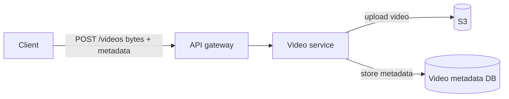

**What's suboptimal (14:00):** every component on the path caps the request body. AWS API Gateway allows 10 MB. So no video over 10 MB can be uploaded. Even without the cap, streaming gigabytes through the gateway and the service costs network and compute on machines that don't need to touch the bytes. Fixed in step 2.

Evan notes this is senior and staff knowledge. A mid-level candidate only needs to know that bytes go in blob storage and metadata goes in a separate database.

### 2) Upload v2: pre-signed URLs and multipart upload, straight to S3 (15:00)

**Decision:** the client uploads the bytes directly to S3 in chunks. The video service only handles metadata.

**How multipart upload works:**

1. Client sends `POST /videos` with metadata, including `sizeBytes`.
2. Video service stores the metadata row and starts an S3 multipart upload for that size. S3 returns an `uploadId`.
3. Video service generates **pre-signed URLs**, one per part. A pre-signed URL is an S3 URL with a signature and expiry baked in, created with the server's credentials. It means "whoever holds this URL may PUT part 17 of upload X for the next hour".
4. Client splits the file and PUTs each part to its URL. The AWS SDK does the chunking for you.
5. Client completes the upload. S3 stitches the parts into one object.

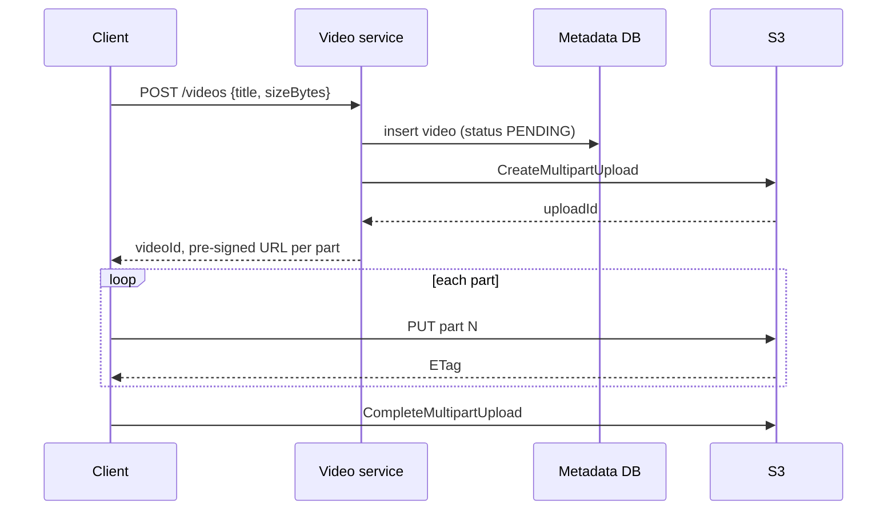

GCS has the same idea under the name resumable uploads.

**Why:** the 10 MB limit no longer matters because bytes never touch the gateway. The service and gateway stay small and cheap. S3 absorbs the bandwidth.

**What's left open (17:30):** the metadata row now has `status: PENDING` and needs an S3 URL. The upload finished somewhere the video service never saw. How does the row find out? Fixed in step 3.

#### Beyond the video: S3 multipart limits and the 256 GB case

- Parts must be 5 MiB to 5 GiB, except the last one.
- An upload can have at most **10,000 parts**.
- So part size must be at least `sizeBytes / 10,000`. For 256 GB that is about 26 MB. The video's "5 to 10 MB" parts would need 25,000 to 50,000 parts and S3 would reject the upload. Pick the part size from `sizeBytes`, for example 64 MB for 256 GB (about 4,000 parts).
- Don't return thousands of URLs in one response. Hand them out in batches, since pre-signed URLs expire (minutes to at most 7 days, shorter with temporary role credentials).
- Abandoned multipart uploads keep their parts and keep billing you. Add a bucket lifecycle rule `AbortIncompleteMultipartUpload` after a few days.

### 3) Upload v3: how the metadata learns the upload is done (17:30)

Two options.

#### Bad: the client tells the video service

S3 answers the client's completion call with the object URL. The client could `POST` that to the video service, which updates the row.

**Challenge:** you're trusting the client. It can lie, crash before calling, or never call. The row stays `PENDING` forever or points at something that doesn't exist. Inconsistent state.

#### Good: S3 event notifications

S3 can emit an event when an object is created. A worker (Lambda, container, anything) receives "upload complete for key X", and updates the row: `status = UPLOADED`, `s3Url = ...`.

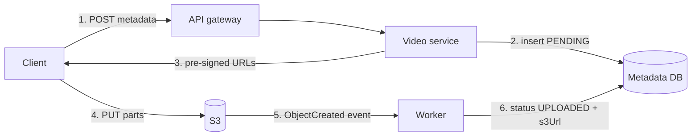

**Why:** S3 is the one component that knows for sure the object exists. The source of truth sends the signal.

#### Beyond the video: S3 events are at-least-once

The write-up says S3 emits the completion event "exactly once". AWS documents event notifications as usually delivered once but occasionally more than once, and very rarely lost. So:

- Make the handler idempotent. A conditional update `SET status = UPLOADED WHERE status = PENDING` does it, and a duplicate event becomes a no-op.
- Put the events on a queue (SQS or EventBridge) instead of calling the worker directly, so bursts and worker outages don't drop them.
- Run a slow sweep for rows stuck in `PENDING` whose object exists, to catch the rare lost event.

### 4) Watch v1: download the whole file (19:30)

**Decision:** `GET /videos/{videoId}` returns the metadata including the S3 URL. The client downloads the file straight from S3 and plays it.

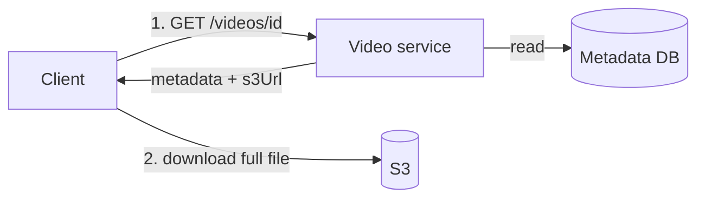

It meets the functional requirement. It breaks the non-functional ones, which is where the deep dives start.

### Where the high-level design stands (20:30)

| Requirement | Status | Why |
| --- | --- | --- |
| Availability over consistency | Met | Uploads finish asynchronously. Existing videos play regardless. |
| Upload large videos | Met | Multipart upload, direct to S3 |
| Stream large videos | **Broken** | The client downloads the whole file before playing |
| First pixels in 500 ms, low bandwidth | **Broken** | A 10 GB download takes minutes, one quality for everyone |
| Scale to 1M uploads, 100M views | Not addressed | Everything reads from one S3 region |
| Resumable uploads | Partly | Multipart makes parts retryable, but nothing tracks progress across sessions |

### The evolution at a glance

| Step | Decision | What it bought | What it broke or left open |
| --- | --- | --- | --- |
| 1 | POST bytes through gateway to service | Simple, one call | 10 MB body limit, bytes flow through servers |
| 2 | Pre-signed multipart upload direct to S3 | Any size, servers never touch bytes | Server doesn't know when upload finishes |
| 3 | S3 event notification updates metadata | Trusted completion signal | Nothing to stream yet |
| 4 | Download the whole file from S3 | Watching works | Minutes to first frame, one quality, fragile |
| 5 | Chunker cuts 2-10 s segments | First frame after one small download | 4K segment still slow on 3G |
| 6 | Transcode each segment to many resolutions | Low-bandwidth users get small segments | Can't switch quality mid-video, metadata row bloats |
| 7 | Manifest file + adaptive bitrate | Client switches quality per segment | Viewers far from S3 region wait on distance |
| 8 | CDN for segments and manifests | Bytes come from nearby edges | Pipeline failures unhandled |
| 9 | Processing as a DAG with an orchestrator | Parallel, retried, observable processing | Resuming an upload after a crash |
| 10 | Server-tracked upload parts | Resume from the last good part | Hot videos hammer the metadata DB |
| 11 | Shard metadata by videoId, add cache | Reads scale | Final design |

## Potential deep dives

### 1) How do we stream large videos? (20:30)

#### Start with numbers

The write-up's example: a 10 GB file at 100 Mbps takes 10 x 8,000 Mb / 100 Mbps = 800 s, about **13 minutes** before the first frame. Also the client needs 10 GB of free space, and the connection must survive the whole transfer. A drop at minute 12 loses everything.

#### Bad solution: download the whole file (step 4)

**Challenges.** Minutes to first frame. Huge memory or disk on the client. One network blip restarts the download. Technically this is download and playback, not streaming.

#### Good solution: split into short segments (21:30)

**Decision:** add a **chunker** worker. When S3 announces a finished upload, the chunker splits the video into 2 to 10 second clips, stores each back in S3, and writes the ordered list of segment URLs into the metadata row.

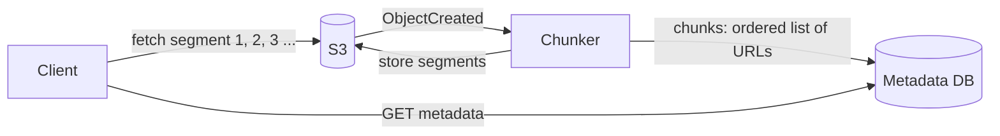

Watching: fetch the list, download segment 1 (a few MB), play it, and fetch the rest in the background. First pixels after one small download.

**Why chunk twice? (23:30)** It looks redundant: the client chunked for upload, S3 stitched it back, and now we chunk again. The two chunk types solve different problems:

| | Upload parts | Streaming segments |
| --- | --- | --- |
| Size | Large (MBs to tens of MBs) | Short in time (2 to 10 s) |
| Cut at | Arbitrary byte offsets | Keyframes, so each segment plays on its own |
| Optimized for | Few HTTP requests, retries | Fast start, switching quality |
| Who cuts | Client (SDK) | Backend (chunker, e.g. ffmpeg) |

A byte-offset upload part can start mid-frame. It can't be played by itself. A segment can.

**Challenges (24:30).** One quality for everyone. On a 2 Mbps connection, one 2-second 4K segment at about 20 Mbps is 40 Mb, which takes **20 seconds**. The 500 ms target fails for anyone on a bad connection.

#### Beyond the video: what is inside a video file (25:30)

Evan explains this as foundation, not something to recite.

- **Container** (MP4, MOV, WebM): the file format. Holds the video track, audio track and metadata.
- **Codec** (H.264, H.265/HEVC, VP9, AV1): how frames are compressed. Instead of storing every pixel of every frame, it stores a full image now and then (a **keyframe**), plus the changes between frames (motion data). Codecs trade encode time, device support, compression ratio and quality.
- **Audio codec**: same idea for sound (AAC, Opus).
- **Parameters**: bitrate, resolution, frame rate, aspect ratio, duration.
- **Bitrate**: bits per second of video. Higher resolution and frame rate mean higher bitrate. Better codecs lower it for the same quality.

The write-up uses "format" as shorthand for a container plus codec pair.

A segment must start at a keyframe, because frames after it are stored as changes relative to it. Cut elsewhere and the first frames of the segment can't be decoded.

#### Great solution: transcode each segment to many resolutions (27:30)

**Decision:** after chunking, a fleet of **transcoders** converts each segment into a ladder of resolutions and bitrates: 4K, 1080p, 720p, ... down to 240p. All segments and all resolutions are independent, so they run in parallel. Outputs go back to S3. Metadata now holds a list of segments **per resolution**:

```json
{
  "240p":  ["s3://.../240p/seg0001.ts", "s3://.../240p/seg0002.ts"],
  "720p":  ["s3://.../720p/seg0001.ts", "..."],
  "1080p": ["..."]
}
```

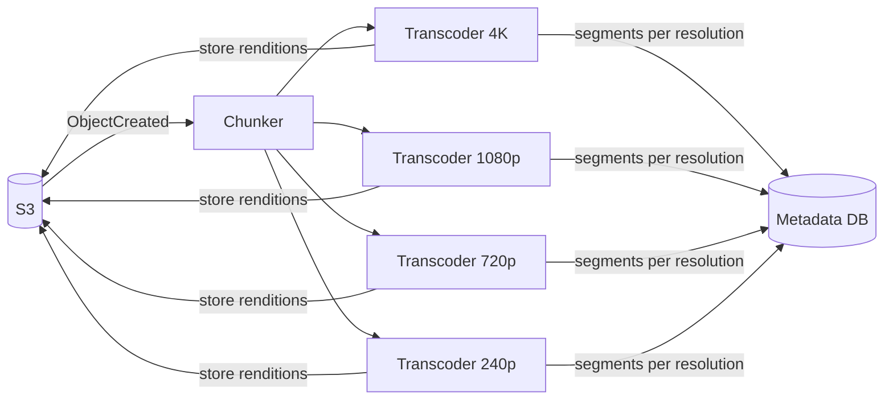

You can't create quality that isn't in the source. A 1080p upload doesn't get a real 4K rendition.

The client checks its connection at start and fetches the resolution it can afford. The 2 Mbps phone gets 240p segments that arrive in well under a second.

**Challenges (29:30).** Network conditions change mid-video. Start in 4K at home on 500 Mbps, walk outside, drop to 3G, and the client keeps asking for 4K segments that now take 20 s each. Also the per-resolution segment lists make the metadata row big. Fixed next.

#### Great solution, completed: manifest files and adaptive bitrate (29:30, 32:00)

**Adaptive bitrate (ABR):** the player keeps measuring throughput and how many seconds are buffered. Before each segment it picks the resolution to fetch. Evan's example: two 4K segments play, the connection drops to 3G, the next request is for 720p. The switch happens at a segment boundary, so the viewer sees a quality change, not a stall.

**Manifest file:** the per-resolution segment list is a standard thing in streaming, called a manifest. It's a text file, so it doesn't belong in the database row. Store it in S3 (and the CDN, deep dive 2). The metadata row keeps only a pointer to it.

The write-up spells out two levels:

- **Primary manifest**: lists the available renditions (resolution, bitrate, codec) and points at each one's media manifest.
- **Media manifest**: one per rendition, lists that rendition's segment URLs in order.

Playback:

1. Client fetches metadata. It contains the primary manifest URL.
2. Client downloads the primary manifest and picks a starting rendition.
3. Client downloads that rendition's media manifest and the first segment.
4. Client plays and keeps downloading segments.
5. Throughput drops, so it switches to a lower rendition's media manifest for the next segment. Throughput recovers, so it steps back up.

This moves work onto the client. The write-up calls that fine: the client is the only component that can see its own network.

#### Beyond the video: HLS, DASH and what they standardize (33:00)

Everything above (segmenting, manifests, multiple renditions, client-side switching) is already packaged as a streaming protocol. You don't have to name them in an interview, but it helps to know:

- **HLS** (HTTP Live Streaming, Apple). Manifests are `.m3u8` playlists. A master playlist lists renditions, media playlists list segments (`.ts` or fragmented MP4).
- **DASH** (Dynamic Adaptive Streaming over HTTP, an open standard). One XML manifest, the MPD.
- **CMAF** lets one set of fragmented MP4 segments serve both HLS and DASH, halving storage.

Both run over plain HTTPS, so any CDN and any HTTP cache works without special support. That's a big reason video won over custom streaming protocols such as RTMP.

Details interviewers can push on:

- **Segment boundaries must line up across renditions.** If 720p segment 7 covers 14.0 to 16.0 s, 1080p segment 7 must cover the same range, or switching jumps or repeats video. Encoders force a keyframe every N seconds in every rendition to guarantee this.
- **Start low, ramp up.** Players often start on a low rendition so the first segment arrives fast, then climb. That is how you meet 500 ms on a bad connection.
- **ABR algorithms**: throughput-based (pick a bitrate below measured bandwidth), buffer-based such as BOLA (pick based on buffer fullness), or hybrids. Buffer-based ones switch less often.

#### Comparing the options

| | Whole file | Fixed-quality segments | Segments per rendition + manifest + ABR |
| --- | --- | --- | --- |
| Time to first frame | Minutes | One segment | One low-rendition segment |
| Low bandwidth | Terrible | Still slow at high res | Picks a small rendition |
| Network changes mid-video | Stalls | Stalls | Switches at next segment |
| Backend work | None | Chunk | Chunk + transcode ladder + manifests |
| Storage | 1x | ~1x | Several x (one copy per rendition) |
| Verdict | Bad | Good | Great |

**The key insight:** streaming is many small downloads, and the client chooses each one. Once the backend precomputes every segment in every quality and publishes an index (the manifest), the client can make the latency and quality trade-off itself, segment by segment. The backend's job becomes offline preparation, not live serving.

### 2) How do we get first pixels fast for viewers far from S3? (31:00)

With segments and ABR in place, the bottleneck is distance. The bucket is in US West. A viewer in Germany pays a transatlantic round trip on every segment.

#### Bad solution: serve everything from the S3 region

**Challenges.** Every request pays 100 to 200 ms of round trip before the first byte. Every view hits the origin bucket, and egress from S3 costs more than CDN egress.

#### Good solution: a CDN in front of S3 for popular segments (31:30)

A CDN is a network of edge servers close to users that act as a cache. Popular segments are cached at the edge nearest the viewer. A viewer in New York hits a New York edge.

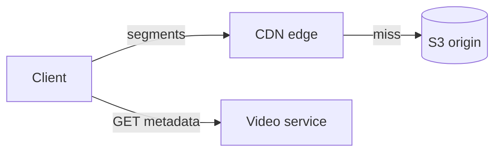

Only popular content lives in each region's edge. The long tail of rarely watched videos still comes from S3 and is slower, which is fine.

**Challenge.** The client still asks the video service for metadata before it knows which manifest to fetch. Two sequential round trips before the first segment.

#### Great solution: manifests in the CDN too, fetched in parallel (32:00)

The manifest is just a file, so cache it at the edge like a segment. Now the client, given a video ID, can fetch the metadata (title, description) and the manifest **at the same time**. It then picks a rendition and pulls segments from the edge. Evan points out the video can start playing before the title has loaded.

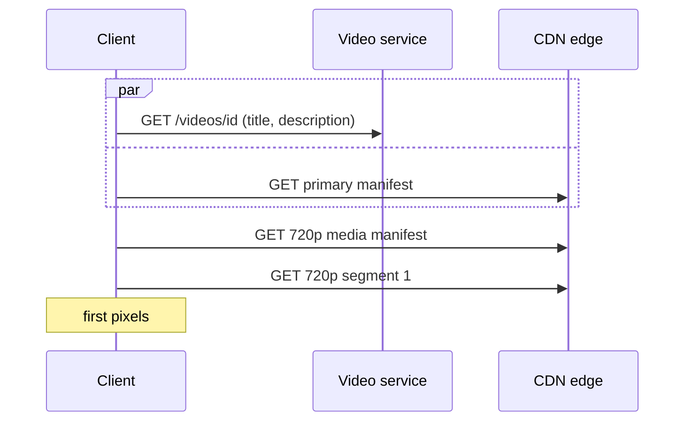

The write-up adds: if manifests and segments are all in the CDN, playback never touches the backend after the start.

#### Beyond the video: why video caches so well, and what it costs

- **Segments and VOD manifests never change.** Serve them with long `Cache-Control` max-age values and the edge never needs to revalidate.
- **Origin shield.** A middle cache tier between edges and S3, so a new viral video's first segment is fetched from S3 once, not once per edge.
- **Egress is the real bill.** Assume a view averages 5 minutes at about 5 Mbps: 5 x 60 x 5 = 1,500 Mb, about 190 MB per view. 100M views x 190 MB is about **19 PB per day**, about **1.8 Tbps average**. Evan calls the CDN "our expensive bit". This is why.
- **Access control.** The video's design hands out raw S3 URLs. For private or unlisted videos you need signed CDN URLs or signed cookies with short expiry, so a leaked URL stops working.

**The key insight:** once playback is just HTTP GETs of immutable files, you scale it by caching those files near viewers. The backend's job at play time shrinks to one metadata lookup.

### 3) How do we process video reliably at 1M uploads a day? (41:30, write-up)

The video ends with the chunker feeding transcoders and mentions, as staff-level material, "what happens if the chunker fails". The write-up turns this into a full deep dive.

#### Numbers

1M uploads/day is about 12 per second on average. Each video fans out into (number of segments) x (number of renditions) transcode tasks. A 10-minute video with 4 s segments and 6 renditions is 150 x 6 = 900 tasks. Transcoding is CPU-bound, so this is the most expensive compute in the system.

#### Bad solution: one worker processes the whole video

**Challenges.** A 12-hour 4K video on one machine takes hours. A crash at 95% restarts from zero. One stuck video blocks a worker.

#### Good solution: chunker and transcoder fleets triggered by S3 events (the video)

Stateless workers, each scaled on CPU or memory (Evan's example: add capacity above 70% CPU or 80% memory, 38:00). Segments transcode in parallel.

**Challenges.** Who knows when all 900 tasks are done so the manifest can be written? What retries a failed task? How do you tell "slow" from "stuck"? A pile of independent workers has no answers.

#### Great solution: a DAG run by an orchestrator (write-up)

The work is a **directed acyclic graph**: split, then fan out per segment (transcode each rendition, process audio, generate a transcript), then fan in (write media manifests, write the primary manifest), then mark the video `READY`.

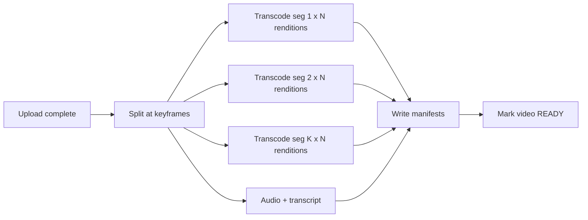

- An orchestrator such as **Temporal** builds the graph, assigns tasks to workers, retries failures and tracks progress. You don't build one.
- Workers pass **S3 URLs**, not bytes, between steps. Intermediate segments live in S3.
- A queue in front of the workers absorbs upload bursts, and queue depth drives autoscaling.

**Challenges.** More moving parts. Each task must be idempotent (the same input key always produces the same output key) so retries are safe.

#### Beyond the video: pipelining and cost

- **Start before the upload ends.** If the client segments before uploading, the backend can transcode part 1 while part 200 is still uploading. The write-up lists this as an extra deep dive. It speeds up publishing, at the cost of client complexity and junk segments from abandoned uploads.
- **Transcode on demand for the long tail.** Most uploads get few views. Real platforms produce a small ladder right away and generate expensive renditions (4K, AV1) only when a video gets popular. This saves a lot of compute.
- **Hardware encoders** (GPUs or YouTube's custom video chips) are how the real thing affords this.

### 4) How do we support resumable uploads? (write-up)

Multipart upload already makes each part retryable. What's missing is knowing, after the client crashes or the laptop reboots, which parts made it.

#### Bad solution: one PUT for the whole file

**Challenges.** Any disconnect restarts the upload. For 256 GB on a home connection, it will never finish.

#### Good solution: multipart with client-side progress

The client remembers which parts it sent. **Challenges.** Reinstall the app or switch laptops and the progress is gone.

#### Great solution: server-tracked parts

1. Client splits the file into parts and computes a fingerprint (hash) per part.
2. Client registers the parts with the backend, each marked `NOT_UPLOADED`.
3. Client uploads each part to S3. S3 returns the part number and an ETag.
4. Client reports it (`PATCH /videos/{id}/parts`). The backend verifies with S3 and marks the part `UPLOADED`.
5. After a crash, the client fetches the video's parts, gets fresh pre-signed URLs for the missing ones, and skips the rest.
6. On `CompleteMultipartUpload`, S3 fires the completion event and processing starts (deep dive 3).

The write-up keeps parts as a `chunks` list inside the metadata row. The final data model below moves them into their own table so each part update is a small write, not a rewrite of a list with thousands of entries.

**Beyond the video: S3 already tracks this.** `ListParts(uploadId)` returns every part S3 has with its ETag. Storing just the `uploadId` on the video is enough to resume. A parts table is still useful if you want fingerprints checked, per-part progress in the UI, or independence from S3's API. In an interview, say both.

### 5) How do we scale to 1M uploads and 100M views a day? (36:00)

Go component by component.

- **Video service**: stateless, scale horizontally. The API gateway load balances. If your gateway doesn't, put a load balancer in front.
- **S3**: effectively unlimited storage and request rate per prefix scales automatically. Its limit is distance (deep dive 2).
- **Chunker and transcoders**: stateless, autoscale on CPU or memory (deep dive 3).
- **CDN**: scales with money.
- **Metadata DB**: needs a closer look.

#### Metadata size, with the video's math corrected (37:00)

Evan's numbers: 1M uploads/day, about 1 KB per row once the manifest moved to S3. He then says this is "like 35 terabytes" a year. It isn't: 1M x 1 KB = 1 GB per day, **about 365 GB per year**. Either way his conclusion holds, and more strongly: this fits on one Postgres instance for years.

Reads are the pressure. 100M views/day is about 1,200 metadata reads per second on average, several times that at peak, and heavily skewed toward a few viral videos.

#### Bad solution: one database serves every read

**Challenges.** Fine for storage, but a viral video's row gets hammered, and a single primary is a single point of failure against the availability requirement.

#### Good solution: shard by videoId (37:30)

Every lookup is a point read by `videoId`, so partition on it. DynamoDB, Cassandra (the write-up's pick: leaderless replication, consistent hashing, high availability) or sharded Postgres all work.

Evan also suggests a sort key on time and a GSI on user ID for "all videos by a user", noting that's out of scope.

**Challenges.** Uniform sharding spreads *videos* evenly, not *views*. A viral video still lands on one partition: a hot key.

#### Great solution: add a cache in front of the metadata DB (write-up)

A distributed cache (Redis or Memcached), LRU, partitioned by `videoId`. Viral video metadata is served from memory. The write-up also suggests raising the replication factor so several nodes can serve a hot row.

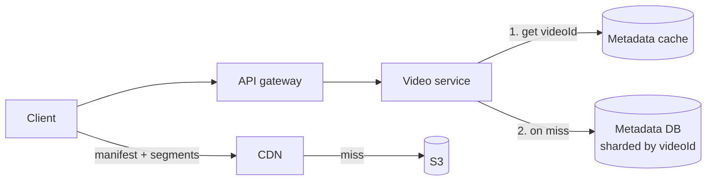

Metadata rarely changes after `READY`, so caching is safe. On a title edit, delete the cache key and let it refill.

#### Beyond the video: storage and the sort key

- **Blob storage is the real growth.** Assume a 500 MB average original: 1M x 500 MB = **500 TB/day** of originals. The rendition ladder adds roughly as much again. That is on the order of **1 PB/day**, hundreds of PB a year. Move originals to cold storage (S3 Glacier) after processing, since they're only needed to re-transcode.
- **The sort key suggestion is muddled.** With `videoId` as the partition key there is one row per video, so a sort key on time sorts nothing. Time belongs on the GSI: partition `uploaderUserId`, sort `createdAt`, which answers "my videos, newest first". The final data model does that.

#### Comparing the options

| | Single DB | Sharded by videoId | Sharded + cache + CDN |
| --- | --- | --- | --- |
| Storage | Fine for years | Fine | Fine |
| Viral video reads | One primary takes it all | One partition takes it all | Served from memory and edges |
| Availability | Single point of failure | Replicas per shard | Cache also shields DB outages briefly |
| Verdict | Bad | Good | Great |

**The key insight:** YouTube is extremely read-heavy (100 views for every upload, far more for viral videos). The write path can stay simple and asynchronous. Every read-path layer (CDN for bytes, cache for metadata) exists to keep popular content away from its source of truth.

### Checking the requirements again (35:30, 39:00)

| Requirement | Status | How |
| --- | --- | --- |
| Availability over consistency | Met | Async processing. New videos appear when ready, old ones keep playing. |
| Upload 256 GB | Met | Pre-signed multipart upload, part size from file size |
| Stream 256 GB | Met | Segments, never the whole file |
| First pixels in 500 ms, low bandwidth | Met | Transcoded ladder, ABR, manifest + segments at the CDN edge |
| Scale | Met | Stateless services, autoscaled workers, sharded and cached metadata, CDN |
| Resumable uploads | Met | Tracked parts, fresh URLs for missing parts |

## Final data model

The notes used many names for a few things. **Video** means two things in the video: the bytes (S3 objects, never a table) and the metadata (the `videos` table). **Chunk** also means two things: an upload part (an S3 multipart part, optionally tracked in `upload_parts`) and a streaming segment (an S3 object listed in a media manifest, never a table). **Uploader**, **creator** and **viewer** are roles of a user, not separate tables. The per-resolution "chunks" list the video stored in the metadata row moves into manifests in S3, and each resolution becomes a `renditions` row.

The same tables, without the mapping, are drawn in the "Data model" area of `12 - Final architecture`.

### Terms mapped to entities

| Term used in the notes | What it is | Stored as |
| --- | --- | --- |
| User | A person with an account | `users` row |
| Uploader / creator | The user who uploaded a video | `videos.uploaderUserId` |
| Viewer | Any user watching | Role, not stored (view counts are out of scope) |
| Video (bytes) | The original uploaded file | S3 object at `videos.originalS3Key` |
| Video metadata | Title, status, pointers | `videos` row |
| Upload status | Where the video is in its lifecycle | `videos.status` |
| `PENDING` (the video's status name) | Upload started, not finished | `videos.status = UPLOADING` |
| S3 URL / "full S3 URL" | Location of the original | `videos.originalS3Key` |
| Upload chunk / part | One multipart part | S3 part, optionally an `upload_parts` row |
| Multipart upload | S3's in-progress upload | `videos.s3UploadId` |
| Streaming chunk / segment / clip | 2-10 s playable piece of one rendition | S3 object, listed in a media manifest |
| Resolution / bitrate / format | One transcoded version (e.g. 720p H.264) | `renditions` row |
| "Chunks by resolution" JSON | The per-resolution segment lists | Media manifests in S3, key on `renditions` |
| Manifest (primary) | Index of renditions | S3 object at `videos.manifestKey` |
| Processing job / DAG | The chunk and transcode work | Orchestrator state, not our table |

### Tables

PK is the partition key, SK is the sort key. This works the same in DynamoDB or Cassandra (partition and clustering key).

**`users`**

| Column | Notes |
| --- | --- |
| `userId` (PK) | |
| `email` | unique, for login |
| `displayName` | |
| `createdAt` | |

**`videos`** (the video metadata)

| Column | Notes |
| --- | --- |
| `videoId` (PK) | generated by the video service on `POST /videos` |
| `uploaderUserId` | FK to `users` |
| `title`, `description` | |
| `sizeBytes` | declared by the client, used to pick the part size and part count |
| `status` | `UPLOADING`, `UPLOADED`, `PROCESSING`, `READY`, `FAILED` |
| `s3UploadId` | S3 multipart upload ID, needed to sign part URLs and to resume |
| `originalS3Key` | where the raw upload lives, set by the S3 event worker |
| `manifestKey` | primary manifest path, set when processing finishes |
| `durationSec` | read from the file during processing |
| `createdAt` | set by the server |
| `updatedAt` | |
| GSI: `uploaderUserId` -> `createdAt` | "my videos, newest first" (optional, channel pages are out of scope) |

Keyed by `videoId` alone because every hot-path read is a point lookup: the watch page and the S3 event worker both know the ID. Status changes use conditional updates (`UPLOADED` only from `UPLOADING`), which makes duplicate S3 events harmless.

The video's version had `chunks` (a list of segment URLs, later per resolution) on this row. Those lists move to manifests, so the row stays about 1 KB.

**`upload_parts`** (optional, for resumable uploads)

| Column | Notes |
| --- | --- |
| `videoId` (PK) | |
| `partNumber` (SK) | 1 to 10,000 |
| `fingerprint` | hash of the part's bytes, computed by the client |
| `etag` | returned by S3 for the part, needed by `CompleteMultipartUpload` |
| `status` | `NOT_UPLOADED` or `UPLOADED` |
| `updatedAt` | |

Answers "which parts are still missing for video X?" with one partition read. Can be dropped in favor of S3 `ListParts(s3UploadId)`. Rows can be deleted once the video is `UPLOADED`.

**`renditions`**

| Column | Notes |
| --- | --- |
| `videoId` (PK) | |
| `renditionId` (SK) | e.g. `720p-h264`, `1080p-av1` |
| `resolution` | `240p` ... `2160p` |
| `codec` | `H264`, `VP9`, `AV1` |
| `bitrateKbps` | written into the primary manifest so players can choose |
| `mediaManifestKey` | S3 path of this rendition's segment list |
| `segmentCount` | |
| `status` | `PENDING`, `READY`, `FAILED` |

Answers "are all renditions of video X done?" before writing the primary manifest and flipping the video to `READY`. Also lets you add a rendition later (AV1 for a newly popular video) without reprocessing everything.

### Relations

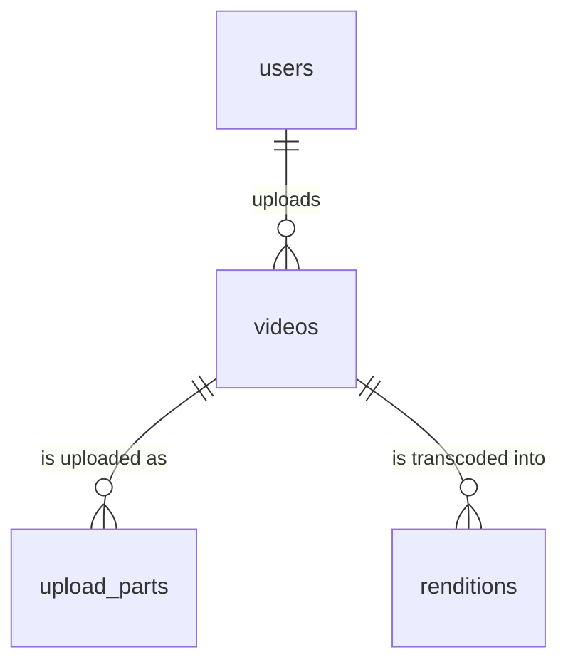

- A user uploads many videos. Viewing creates no rows.
- A video has up to 10,000 upload parts while uploading, and none after cleanup.
- A video has one rendition per resolution and codec, usually 5 to 10.
- Segments and manifests hang off renditions in S3, not in the database.

### How the tables work together on upload and first play

Priya uploads a 40 GB 4K video. Sam watches it on a phone on 3G.

1. Priya's client calls `POST /videos` with title and `sizeBytes = 40 GB`. The service inserts a `videos` row (`status UPLOADING`), starts a multipart upload, stores `s3UploadId`, and picks 16 MB parts: 2,500 parts.
2. The client registers 2,500 `upload_parts` rows as `NOT_UPLOADED` and gets pre-signed URLs in batches.
3. Her laptop sleeps at part 1,800. When it wakes, the client reads `upload_parts` for the video, gets fresh URLs for parts 1,801 to 2,500 and finishes.
4. The client calls `CompleteMultipartUpload`. S3 emits the event. The worker conditionally updates `videos`: `status UPLOADED`, `originalS3Key` set.
5. The orchestrator starts the DAG, sets `status PROCESSING`, and inserts one `renditions` row per rung of the ladder as `PENDING`.
6. Transcoders write segments to S3. When a rendition's media manifest is written, its row becomes `READY`.
7. When every required rendition is `READY`, the pipeline writes the primary manifest, sets `videos.manifestKey` and `status READY`.
8. Sam opens the video. The service reads `videos` (from cache after the first viewer) while his player fetches the primary manifest from the CDN. His player picks 240p and pulls segments from the edge. No table is touched after that.

### What is not a table

- **Original file, segments and manifests.** S3 objects. The database stores keys, never bytes or segment lists.
- **CDN cache contents.** Filled on demand from S3.
- **Metadata cache entries**, `video:{videoId}`. Rebuilt from `videos` on a miss.
- **S3 event notifications and the job queue.** Transient messages.
- **DAG progress and retries.** Kept by the orchestrator (Temporal has its own store). `renditions.status` is the durable summary we care about.
- **Views.** Watching writes nothing in this scope. View counts would be a separate deep dive.

### The limit this model creates

S3 caps a multipart upload at 10,000 parts, so `upload_parts` has at most 10,000 rows per video and the part size must be at least `sizeBytes / 10,000`. With a 256 GB maximum that means parts of at least about 26 MB. On a flaky connection a failed part costs more to redo, so the product rule is to derive part size from file size, not fix it at the video's 5 to 10 MB. The other limit is a hot row: one viral video's `videos` row gets all the reads for that video, which is why the cache is part of the final design and not optional.

## Beyond the video: gaps worth knowing

- **Idempotent `POST /videos`.** A retried create makes two video rows and two multipart uploads. Have the client send an idempotency key.
- **Cleanup.** Abandoned uploads (lifecycle rule to abort incomplete multipart uploads), rows stuck in `UPLOADING`, and intermediate pipeline files in S3.
- **Failure states.** A corrupt upload or unsupported codec must end in `FAILED` with a reason the creator can see, not a video stuck in `PROCESSING`.
- **Publishing early.** You can flip to `READY` once a low rendition finishes and add higher ones later. The primary manifest is rewritten as renditions land.
- **Security.** Private and unlisted videos need signed CDN URLs. Uploads need content scanning before publishing (out of scope here, but real).
- **Resume watching.** The write-up mentions storing each user's position per video. That is a new, write-heavy table (`userId`, `videoId`, `positionSec`), updated every few seconds per viewer, so it would dominate write volume.
- **View counts.** 100M+ increments a day on skewed keys. Needs batched or approximate counting, and it's a deep dive on its own.
- **Live streaming** is a different problem. Segments are produced in real time, manifests change every few seconds and can't be cached for long.

## What is expected at each level? (39:30)

### Mid-level

The interviewer will lead you to chunking with hints ("a 10 GB download takes how long?"). Getting to chunking and CDNs is enough. You may not reach transcoding, and it's fine to arrive at "store different resolutions" without the word. You should know bytes go in blob storage and metadata in a separate database, and that you talk to S3 directly for upload and streaming. The write-up adds: clear API and data model, and some clarity on one deep dive.

### Senior

Chunking on both sides without prompting. Know multipart upload, since it's the standard way to upload large media, and how it supports resumable uploads. Understand that streaming needs segments even if you've never heard of HLS. Transcoding proactively or with a hint is fine. Reach CDN and manifest optimizations, even without the word "manifest". Get through the high-level design fast to spend time on post-processing and upload details.

### Staff+

Largely proactive on chunking, transcoding and splitting metadata from blobs. HLS and DASH aren't expected unless you've built streaming. Teach the interviewer something: DAG orchestration, retries and failures ("what if the chunker fails"), trade-offs between options, spoken as a peer.

## Check yourself

1. Why does the design split "video" from "video metadata" as core entities?
2. What breaks in upload v1, and what number causes it?
3. What is a pre-signed URL, and why does it keep the video service small?
4. Why shouldn't the client tell the service that its upload finished? What does instead?
5. S3 event notifications are at-least-once. What must the handler do about it?
6. Why chunk twice, once for upload and once for streaming? Give two differences between the chunk types.
7. Why must a streaming segment start at a keyframe?
8. A viewer on 2 Mbps asks for a 2 s 4K segment at 20 Mbps. How long does it take, and what fixes it?
9. What is in a primary manifest vs a media manifest, and why store manifests in S3 and the CDN instead of the metadata row?
10. Why must segment boundaries line up across renditions?
11. The video estimates metadata at 35 TB a year. What's the correct number, and does the conclusion change?
12. Why is a sort key on time useless with `videoId` as the partition key, and where does time belong?
13. What stops a 256 GB upload using 8 MB parts, and what's the minimum part size?
14. In the final data model, which of "chunk", "segment", "rendition" and "manifest" are tables, and which are S3 objects?
15. Why is the metadata cache needed even after sharding by `videoId`?

<details>
<summary>Answers</summary>

1. Bytes are huge and immutable, so they belong in cheap blob storage. Metadata is tiny, mutable and looked up by ID, so it belongs in a database. They are stored and served differently.
2. Request body limits on the path. AWS API Gateway caps bodies at 10 MB, so any video over 10 MB fails. Bytes also waste bandwidth and compute on the gateway and service.
3. An S3 URL signed with the server's credentials that allows one specific operation (PUT part N of upload X) until it expires. The client uploads straight to S3, so bytes never pass through the service.
4. The client can lie, crash or never call, leaving the row inconsistent. S3 event notifications come from the component that knows the object exists, and a worker updates the row.
5. Be idempotent, for example a conditional update from `UPLOADING` to `UPLOADED`, so a duplicate event is a no-op. Also queue events and sweep stuck rows for the rare lost one.
6. Upload parts are large, cut at arbitrary byte offsets and optimized for few requests and retries. Streaming segments are 2-10 s, cut at keyframes, playable alone, and optimized for fast start and quality switching.
7. Frames after a keyframe are stored as changes relative to it. A segment starting elsewhere can't be decoded on its own.
8. 2 s x 20 Mbps = 40 Mb, and 40 / 2 = 20 s. Transcoding into a ladder of lower bitrates, plus adaptive bitrate on the client, fixes it.
9. Primary: the list of renditions with bitrate, resolution and codec, pointing to media manifests. Media: one rendition's ordered segment URLs. They are files the player fetches directly, cacheable at the edge, and fetching them from the CDN in parallel with metadata removes a round trip. It also keeps the DB row small.
10. The player switches renditions at segment boundaries. If segment 7 covers different time ranges in each rendition, switching skips or repeats video.
11. 1M x 1 KB = 1 GB/day, about 365 GB/year. The conclusion (fits on one instance for years) gets stronger.
12. There's one row per `videoId`, so there's nothing to sort within a partition. Time belongs as the sort key of a GSI partitioned by `uploaderUserId`, for "my videos, newest first".
13. S3 allows at most 10,000 parts. 256 GB / 8 MB = 32,000 parts, so it's rejected. Minimum is about 256 GB / 10,000, about 26 MB. In practice use 32 or 64 MB.
14. `renditions` is a table (one row per resolution and codec). Upload chunks are S3 parts, optionally tracked in `upload_parts`. Segments and manifests are S3 objects, with only manifest keys stored in tables.
15. Sharding spreads videos evenly, not views. A viral video's row lives on one partition and gets all its reads. The cache serves hot rows from memory.

</details>
